# Lane Pilot

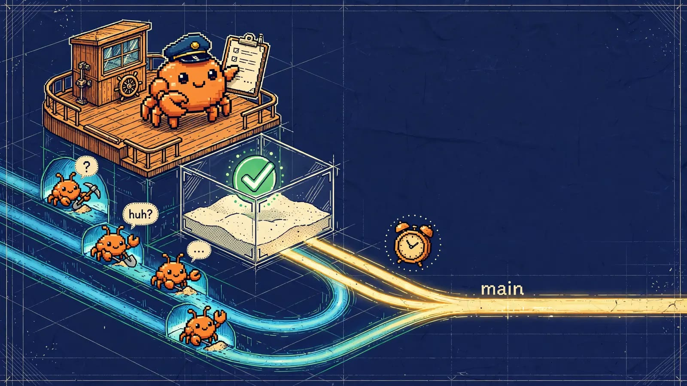

Lane Pilot is a BB plugin that turns a BB chat into a project manager (PM) for a code project. The PM plans the work, hands each task to a writer agent in its own BB thread and git worktree, has the result checked, reviewed and merged into `main`, and keeps going without the owner until something really needs a human decision.

It builds on [Lane Stack](https://github.com/VKirill/claude-lane-stack) (MIT): the terminal workflow (`claude` / `adoc`) stays as installed, and Lane Pilot adds the same discipline inside BB.

**По-русски коротко.** Lane Pilot делает из чата BB менеджера проекта. PM пишет план и задачи, каждую задачу делает отдельный исполнитель в своём треде BB и своём рабочем дереве git. Lane Pilot проверяет работу в песочнице, прогоняет ревью, сливает в `main`, а при блокировках сам спрашивает другие треды и ставит себе напоминания. Для полноценной работы нужно экспериментальное ядро BB, см. [Требования](#requirements).

> [!WARNING]
> **Feature freeze (2026-10-07) until phase E of the stabilization plan is done.** Only tasks from that plan and incident fixes are accepted; no new Lane Pilot features.

> [!IMPORTANT]
> **Lane Pilot needs the experimental BB core.** Use a BB server built from the fork [VKirill/bb, branch `vk/experimental`](https://github.com/VKirill/bb/tree/vk/experimental): the official BB release with additional `vk` functions on top. On a stock BB the plugin loads, but the PM chat cannot be enabled from the composer and Claude Lane is not installed on the machines. See [Requirements](#requirements).

| Field | Value |
|---|---|
| Version | see [CHANGELOG.md](CHANGELOG.md) |
| Runs on | BB server (hub) + `bb.host` worker on every enrolled machine |
| Data | plugin SQLite and KV in BB storage, per project |
| Public repo | https://github.com/VKirill/bb-plugin-lane-pilot |
| Architecture | [docs/architecture.md](docs/architecture.md) |

## Contents

- [Requirements](#requirements)
- [Screenshots](#screenshots)
- [How a task goes through Lane Pilot](#how-a-task-goes-through-lane-pilot)
- [What the plugin does](#what-the-plugin-does)
- [PM tools](#pm-tools)
- [Settings](#settings)
- [CLI](#cli)
- [Install, update, deploy](#install-update-deploy)
- [Lane Stack engine on hosts](#lane-stack-engine-on-hosts)
- [Known limits](#known-limits)
- [Development](#development)

## Requirements

| What | Version |
|---|---|
| BB server | **experimental core** from [VKirill/bb `vk/experimental`](https://github.com/VKirill/bb/tree/vk/experimental), based on BB ≥ 0.43.3 (currently 0.44.0) |
| Plugin SDK | `@get-bb/plugin-sdk` ≥ 0.4.104 |
| Node | 22.19+, 24 or 26 |
| Machines | enrolled BB hosts with git; `bwrap` (bubblewrap) on Linux, `sandbox-exec` on macOS for checks |
| Optional | TypeSafe Jev key `TYPESAFE_API_KEY` in Env Catalog (routing, triage, council judge); a WireGuard (or Tailscale) network between machines for browser checks of dev servers on another machine |

### Experimental core functions

The fork adds functions with the `vk` prefix; Lane Pilot feature-tests each one ([`vk-requires.json`](vk-requires.json)). What each is for and what happens without it:

| Function | Kind | What Lane Pilot uses it for | Without it |
|---|---|---|---|
| `useComposer().experimental_vkSetDispatchData` | required | the «Enable for this chat» button attaches the Lane profile to the next new chat without changing its text | the PM chat cannot be enabled from the composer |
| `experimental_vkLifecycle` / `bb.server.experimental_vkPluginLifecycle` | required | on enable, installs or repairs Claude Lane on every registered machine | native installation refuses to run; machines must be prepared by hand |
| `bb.agents.experimental_vkSessionPolicy` | optional | session rules of the core (which plugins, skills, MCP servers a session loads, set for example by Project Folders); Lane Pilot detects them to decide how helper threads inherit the PM chat's context | helpers run with BB's ordinary context |
| `experimental_vkRequiredSessionPolicy` | optional | a helper context of its own for writers, critics and specialists («selected» / «none» in settings): the snapshot is written with the thread at spawn, enforced on every turn and inherited by its children | those two options are refused (`helper_context_required_api_unavailable`); the default «inherit» works |
| `experimental_vkCompiledMainAgent` | optional | a compiled main agent profile fixed on a Claude Code thread at spawn | the profile comes from the Lane agent definition and instructions |

The fork keeps both snapshots and their digest markers in reserved thread plugin metadata rows, with no database migrations and no host-daemon protocol change; provider bridges report support in their handshake. Since `0.44.0-vk.12`.

How the fork is kept in step with official BB releases, and how to add a function: `VK_PATCHES.md` and `VK_FUNCTIONS.md` in the fork's `vk/experimental` branch.

## Screenshots

The plugin page in BB (a sandbox project, real data from the hub).

| | |
|---|---|
| 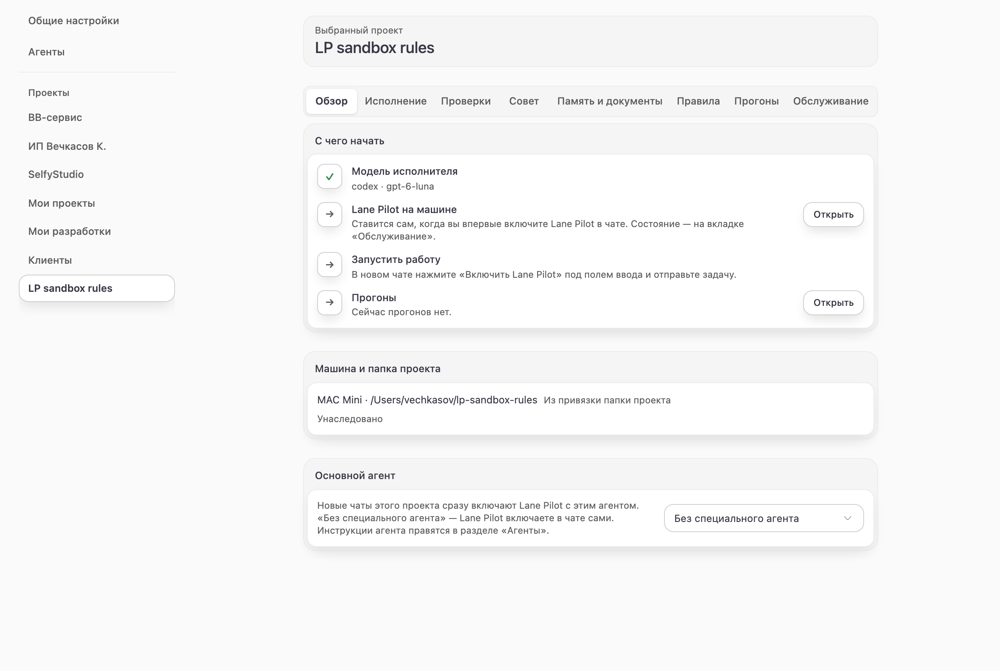 **Overview** — first steps, machine and folder, main agent | 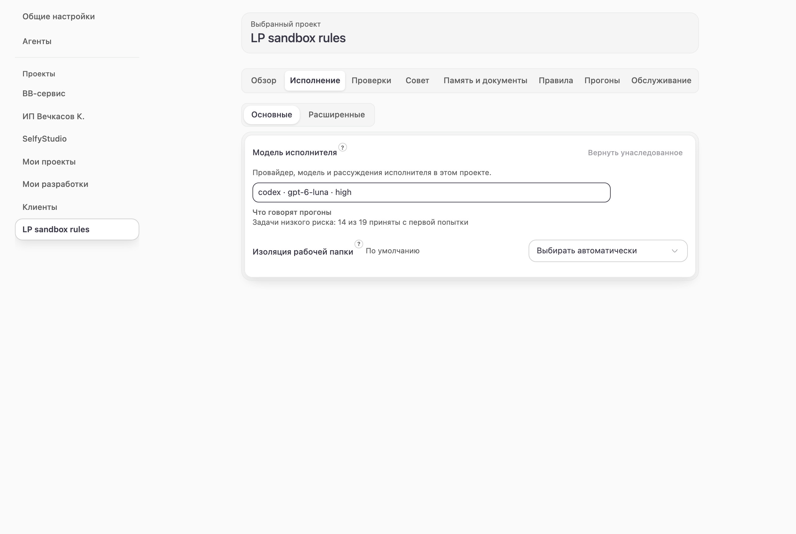 **Execution** — writer model with its first-try statistics, workspace isolation |
| 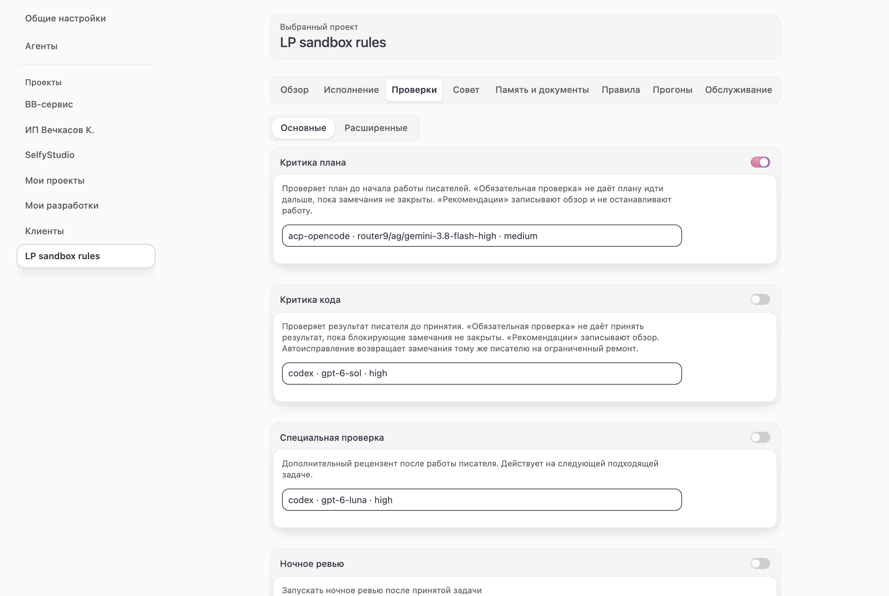 **Checks** — plan and code critique, specialist review, browser check | 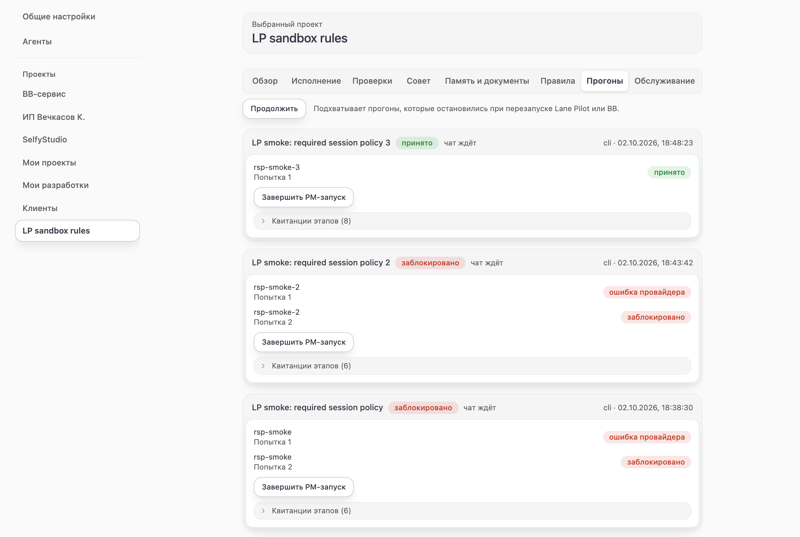 **Runs** — PM runs, attempts and their states, stage receipts |
| 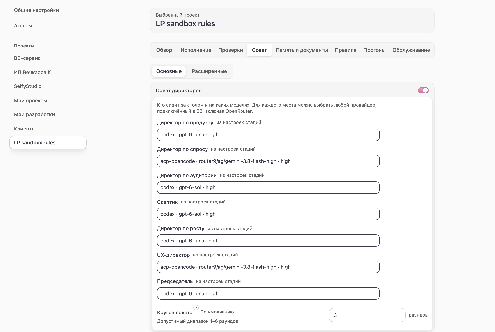 **Council** — council of directors on a product question | 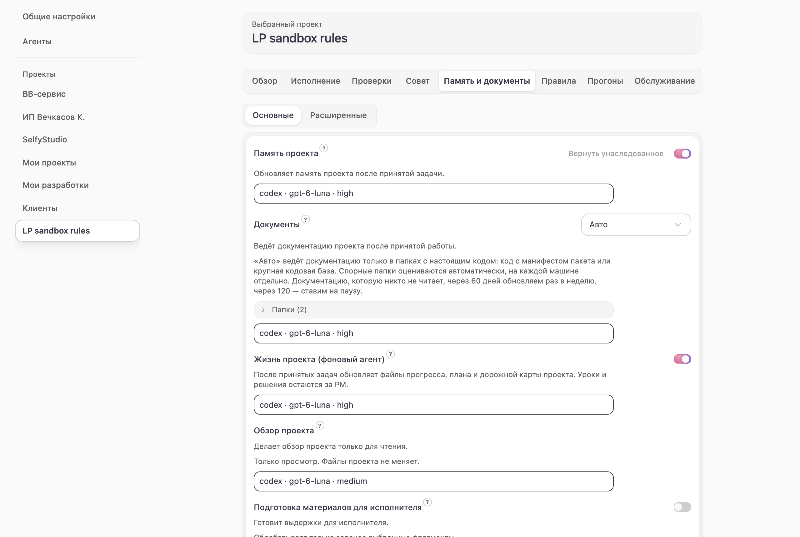 **Memory and docs** — project memory and wiki maintenance |
| 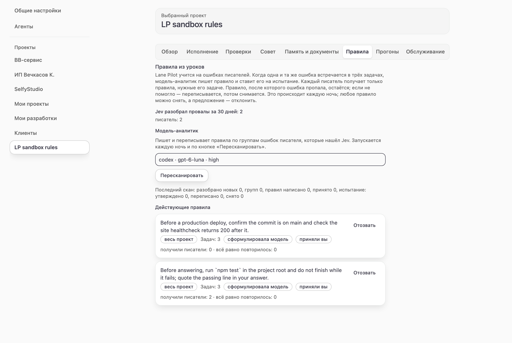 **Rules** — rules learned from failed attempts | 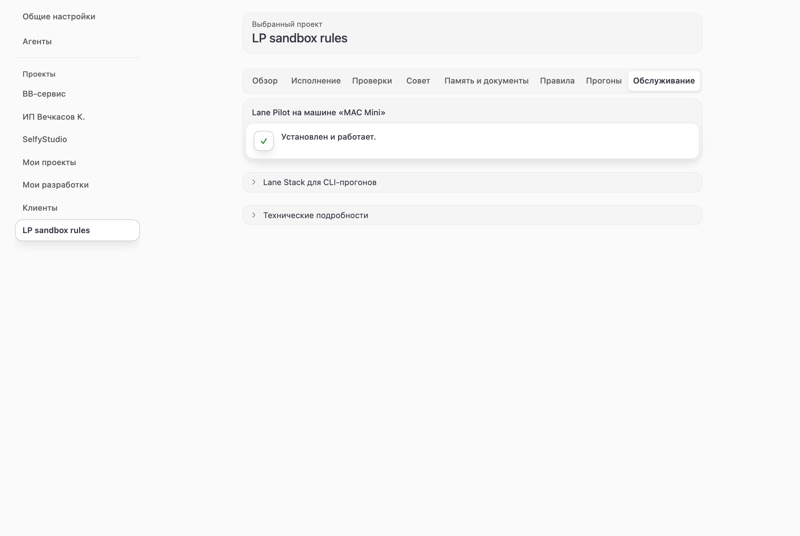 **Maintenance** — Lane Pilot on the machines, install and repair |
| 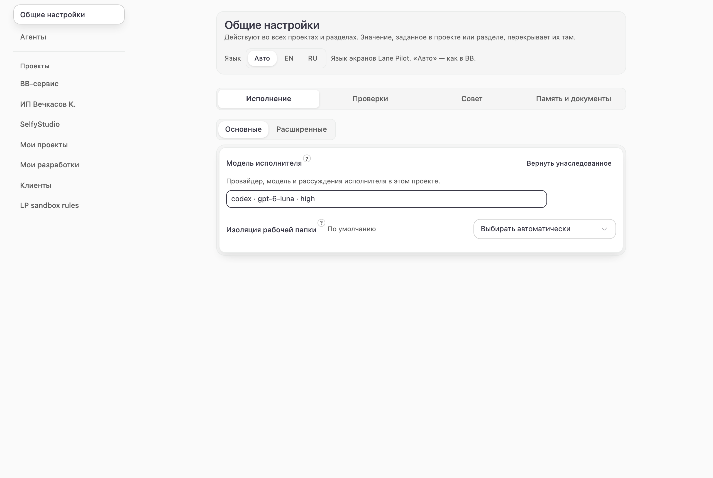 **Global settings** — defaults every project inherits | 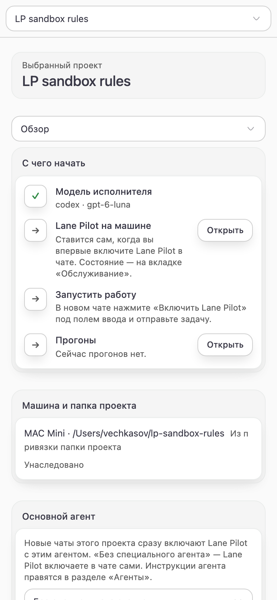 **Phone** — the same page at 390 px |

## How a task goes through Lane Pilot

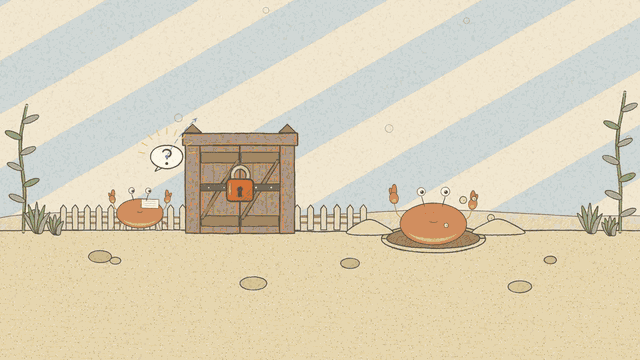

**[Watch the full film (32 s, with sound)](https://github.com/VKirill/bb-plugin-lane-pilot/releases/download/v0.1.75/crab-lanes-720.mp4)**: a captain crab plans, writer crabs take their cards and dig their own burrows, a sandbox checks the work, a critic looks again, crabs ask each other instead of the owner, the lock merges one at a time into main, and mistakes become rules. Drawn and scored entirely in code.

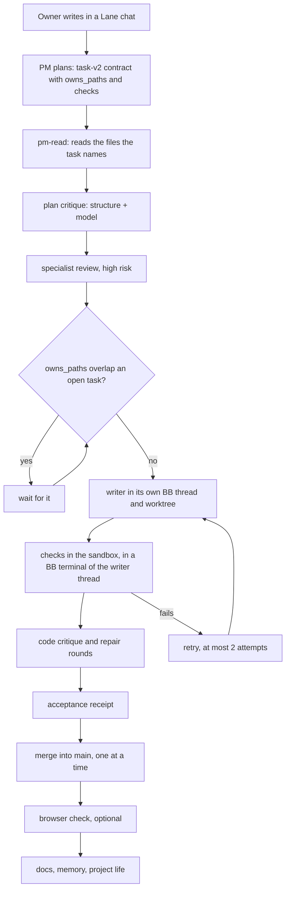

Every stage writes a receipt (state, input and output hashes, attempt, provider, model, thread). The PM sees them through `lane_pilot_wait_writer`; failed attempts are triaged by fault and kind.

## What the plugin does

### PM chat

- «Enable for this chat» in the BB composer turns a new chat into a Lane PM (Claude Code, Opus 5.5, 1M context when the machine has it). The PM's instructions: plan, dispatch in the same turn, never edit product code itself (the `guard_shell.py` hook limits PM edits to `.agents/**` and plans), ship when the batch is accepted.
- The PM does not ask the owner what it can resolve itself: retries, waits on other threads, timing. It asks for business meaning, money or data that cannot be undone, a missing secret, or a real ambiguity.
- Working helpers show as squares next to the agent badge above the composer; a click opens the thread in the side panel.

### Writers and parallel work

- Each writer attempt runs in its own BB thread. In «Choose automatically» and «Worktree» modes it also gets its own git worktree (a BB-managed «Worktree» environment, or Lane Pilot's own `lane/<attempt>` worktree under `~/.lane-pilot/worktrees/`). `node_modules` is mirrored and workspace `dist/` and `.nuxt/` are copied, so monorepo checks work in the worktree.
- Up to `ops.pool_size` writers (default 5, max 10) work at once. A task whose `owns_paths` may overlap an earlier open task's waits for it, so two writers never edit one file at the same time; disjoint tasks run side by side.
- «In the project folder» mode runs writers one at a time in the checkout itself.
- Writer provider, model, reasoning and service tier come from BB's native catalog for the project's machine. A circuit breaker stops dispatching to a failing provider; an emergency writer selection takes over after a provider error.
- A writer that cannot proceed without a human answers `NEEDS_HUMAN: <question>`, and the attempt stops instead of guessing.

### Checks

- Every verification command of a task runs in a sandbox (bubblewrap on Linux, seatbelt on macOS) in a BB terminal of the writer's thread, so it can be watched live. Writes are limited to the task's folder and a temp folder; the network is open; protected state (`.git`, guard files) is read-only.
- The project's BB machine variables (global and project, importable from Env Catalog) reach the checks by name; values stay in the terminal's shell and never pass through Lane Pilot or its logs.
- Tool caches written by checks (`.vite`, `.turbo`, `.cache`, …) are not counted as the writer's change and stay out of git.
- `ops.verify_pool_size` bounds checks running at once.

### Acceptance and merge

- Ownership: the writer's changes (working tree and commits) must fall inside its `owns_paths` and outside `never_touch`; bookkeeping written by hooks and other agents (`.agents/`, `.bb/`, …) is ignored.
- Optional code critique with automatic repair rounds (`code_critique.*`).
- Accepted work is committed in the worktree and merged into `main` of the run's checkout under a lock, one merge at a time. A merge that finds the checkout busy waits up to 15 minutes; a lock left by a killed process is taken over at once; a conflict sends the task back to be redone on the new `main`.

### Browser check

- `lane_pilot_browser_qa` runs a child thread that drives the BB browser on the Browser QA machine (the Mac mini) per case and viewport, with screenshots, and returns passed / failed / blocked.
- `devServer`: the check's thread starts the dev server in its own BB terminal and closes it afterwards. A localhost target on another machine is opened at that machine's private VPN address (WireGuard `wg*`, `utun*`, Tailscale), not through a public tunnel.
- A check that could not be made (no QA machine, machine offline, port unreachable) can run again for the same task; a verdict on the product is final.

### When work is blocked

- `lane_pilot_wait_writer` returns `blockedBy`: what holds the task, the holder's task and thread, since when, when to look again.
- The relay lets the PM ask another thread (`lane_pilot_ask`, queued without interrupting it), get the answer back (`lane_pilot_reply`, or the thread's last message if it ends without answering) and set itself reminders (`lane_pilot_remind`) that fire after N minutes or as soon as a watched thread is really free (idle, nothing queued, no background command or agent at work).
- The plugin server does the waking: a BB `thread:changed` subscription plus a 30-second sweep. Limits: 6 questions an hour between two threads, 10 open and 30 daily reminders per thread. After three reminders on one block without progress the PM writes to the owner.

### Specialists and council

- `lane_pilot_specialist`: design-lead (DESIGN.md, UX audit, prototype), copy-lead, seo-specialist or tavily (web research) as a child thread the owner can open.
- `lane_pilot_handoff_*`: typed task cards between agents with receipts, leases and deadlines.
- Council of directors (`lane_pilot_council_*`, sidebar page «Совет»): seats with distinct models discuss a product question, a Jev judge moderates, the owner joins at any time, the decision is written under `docs/decisions/`.

### Memory, rules and docs

- Per-project memory corpus in plugin SQLite with audiences and token budgets; only `subagent` records reach writer prompts. Memory maintenance runs after accepted work.
- Every failed attempt is triaged (code first, then Jev): orchestrator, writer, environment or task. Writer mistakes seen in three tasks become rule proposals; rules adopt themselves on trial, are confirmed after clean use and retired when unused (`lane_pilot_lessons_sweep`, «Rules from lessons» in settings, nightly at 03:30).
- Docs maintenance keeps the project wiki current after accepted work and on a schedule (`docs.*`); onboarding preview/apply writes the project passport; project life updates `.agents/PROGRESS.md` and the changelog.
- Night review (`lane_pilot_night_review` / `_night_fix`): Codex review of the day's branch and bounded fixes; merge only when `night_review.auto_merge` is on and the PR is green.

### Reliability

- Reload recovery: after a plugin reload Lane Pilot finds open attempts, re-attaches to writers still at work and reruns an interrupted acceptance. Writer threads themselves are not affected by a reload.
- Runs of deleted or archived PM chats, and chatless runs older than a day, are closed automatically.
- Run budgets (`run.max_*`), provider breaker and stream retry after dropped provider streams (`lane_pilot_run_health`, `bb lane-pilot health`).
- **Self-repair.** Every 15 minutes Lane Pilot looks for failures that are its own fault: triage origin «orchestrator», system block reasons (`internal_error`, `merge_failed`, spawn errors, EROFS…) and attempts left «running» after their writer went idle. Failure lines of the plugin log count too. Each new kind of problem, grouped by a normalized reason, gets one repair thread in the Lane Pilot repository (Claude Code, Opus 5.5, high reasoning, standard speed, full access), filed in the Project Folders section «Исправления». The thread finds the cause, fixes it with a test, checks it live, ships on a green suite (the deploy script refuses a red one) and tells the affected PM. One repair at a time, at most 4 a day. Only failures under the running version count, so what a release already fixed is not repaired again; the thread ends with a verdict (`fixed`, `already-fixed`, `not-lane-pilot`, `needs-owner`) that decides whether the kind may come back. Besides failures it looks for tasks queued for hours while nothing runs, stages left open after their task ended and any reason repeated in 3 tasks a day. `scripts/self-repair-watchdog.sh` (launchd, every 30 min) starts a repair if the watcher itself goes silent. `self_repair_status` gives the last 24 hours: attempts, failures by fault, open incidents, repairs; `self_repair_configure` changes the target project, environment, model and limits; `self_repair_tick` runs a pass now (`dryRun` by default).

## PM tools

| Tool | Purpose |
|---|---|
| `lane_pilot_dispatch_writer` / `lane_pilot_wait_writer` | dispatch a task-v2 contract with its plan; wait for the receipt (≤ 240 s per call) |
| `lane_pilot_dispatch_cli` | run a task through the terminal Lane Stack on the project host |
| `lane_pilot_read` | bounded read of large files in the writer workspace |
| `lane_pilot_workspace_status` | the run's checkout and worktrees |
| `lane_pilot_browser_qa` | browser check of an accepted task |
| `lane_pilot_specialist` / `lane_pilot_wait_specialist` | specialist child threads |
| `lane_pilot_ask` / `lane_pilot_reply` / `lane_pilot_remind` / `lane_pilot_relay_list` | questions, answers and reminders between threads |
| `lane_pilot_handoff_create` / `_receipt` / `_list` | task cards between agents |
| `lane_pilot_council_start` / `_status` / `_say` / `_stop` | council of directors |
| `lane_pilot_memory_context` / `_maintain` / `_import` / `_export` / `_golden` | project memory |
| `lane_pilot_lessons_sweep` / `lane_pilot_rule_propose` | lessons and rules |
| `lane_pilot_routing_stats` / `lane_pilot_run_health` / `lane_pilot_gate_report` / `lane_pilot_gate_triage` | statistics, health, gate reports |
| `lane_pilot_docs_maintain`, `lane_pilot_onboarding_preview` / `_apply` | docs and onboarding |
| `lane_pilot_night_review` / `lane_pilot_night_fix` | night review |
| `lane_pilot_ingest_opencode_telemetry` | OpenCode lane telemetry |

## Settings

The settings page lists projects (and Project Folders sections) on the left and the selected scope's settings on the right; a section inherits from its parents and can override any value. Technical fields are under Diagnostics.

| Group | Main keys |
|---|---|
| Writer | `writer.provider`, `writer.model`, reasoning, `writer.service_tier`, emergency writer |
| Workspace | `adoc.040` isolation: `auto` (default, worktree per attempt) / `worktree` / `in_place` (one at a time in the checkout) |
| Pools and timing | `ops.pool_size` (writers at once, ≤ 10), `ops.verify_pool_size`, `ops.command_timeout`, `ops.max_runtime` |
| Stages | `plan_critique.*`, `specialist.*`, `pm_read`, `code_critique.*`, `browser_qa.*` (`browser_qa.host_id` = the Browser QA machine), `night_review.*` |
| Memory and docs | `memory.*`, `docs.*` |
| Jev routing | `jev.*` (plan effort, triage, council judge) |
| Budgets | `run.max_*` |

## CLI

`bb lane-pilot <command>`; `bb lane-pilot` alone prints the list.

| Command | Purpose |
|---|---|
| `activate`, `deactivate`, `state <project>`, `finish <project> [run]`, `resume [project]` | PM runs |
| `cancel <attempt>`, `recover <attempt>` | attempts |
| `dispatch-bb`, `dispatch-cli` | dispatch from the terminal |
| `budget`, `health` | run budgets, provider health |
| `council`, `council-status`, `council-say`, `council-seats` | council |
| `docs-nightly` | docs pass now |
| `host-detect`, `host-install`, `host-rollback`, `host-snapshot*`, `host-import-config`, `host-connect-opencode`, `host-run-cli` | machines and the Lane Stack engine |
| `events-list`, `wait-thread`, `start-*-probe` | diagnostics |

Plugin RPC for scripts: `bb plugin rpc call lane-pilot <method> --input-file <json>`.

## Install, update, deploy

```sh
bb plugin install git:https://github.com/VKirill/bb-plugin-lane-pilot.git --yes
```

Or from a checkout the BB server can read:

```sh
npm ci && npm run build
bb plugin install path:<absolute-checkout-on-the-server-host> --yes
```

Update: pull `main`, `npm run build`, reload `lane-pilot`. A reload restarts Lane Pilot on the server and every machine; writer threads keep working, and recovery picks up their attempts. Avoid reloading in the middle of an acceptance (checks and merge): the deploy script `bb-plugin-push` waits up to 10 minutes for running acceptances (`LP_DEPLOY_FORCE=1` skips the wait).

Rollback: install the previous commit, `git:…@<commit>`.

## Lane Stack engine on hosts

The terminal workflow and CLI writers use the Lane Stack installed on the project's machine; Lane Pilot probes its interfaces and reuses a compatible engine (newer or custom included) without writing to it.

| # | Situation | Lane Pilot |
|---|---|---|
| S1 | Required interfaces work | reuse; no engine, config or cache writes |
| S2 | Marker present, engine incompatible | isolated managed checkout; user configs untouched |
| S3 | No engine | same isolated managed path |
| S4 | Project already configured | idempotent |
| S5 / S6 | OpenCode config present / absent | additive JSONC `plugin[]` patch / skip |
| S7 | Existing YAML | one-shot import into plugin storage |
| S8 | BB run | never writes routing, night-shift or capabilities; never `adoc --apply` |

The 366-row settings applicability matrix is in [docs/adoc-applicability.md](docs/adoc-applicability.md). Files under `lane-stack/hooks/` and `lane-stack/schemas/` are upstream MIT copies.

## Known limits

- Writers and ordinary threads have no `lane_pilot_reply`; their last message is passed back instead.
- The overlap check is conservative: a pattern's literal folder is compared, so a task can wait when it would not really have collided.
- BB's selected UI language is not exposed to plugins; Lane Pilot uses `auto` (Russianizer signal, then the browser language) or an explicit EN/RU override.
- External operations (open-cursor install, Claude marketplace plugins) run only after explicit confirmation; their rollback is best effort.
- A finished PM run keeps its history (`state=closed`); finishing needs no open attempts and an idle PM thread.

## Development

```sh
npm test            # vitest
npm run typecheck
npm run build       # bb plugin build: server, host worker, app
```

Code layout, dependency rules and packages (`@lane-pilot/thread-observe`, `memory-core`, `handoff`, `resilience`, `run-insights`, `council`): [docs/architecture.md](docs/architecture.md).

## License

MIT. Upstream Lane Stack copies: Copyright (c) 2026 VKirill and contributors.
