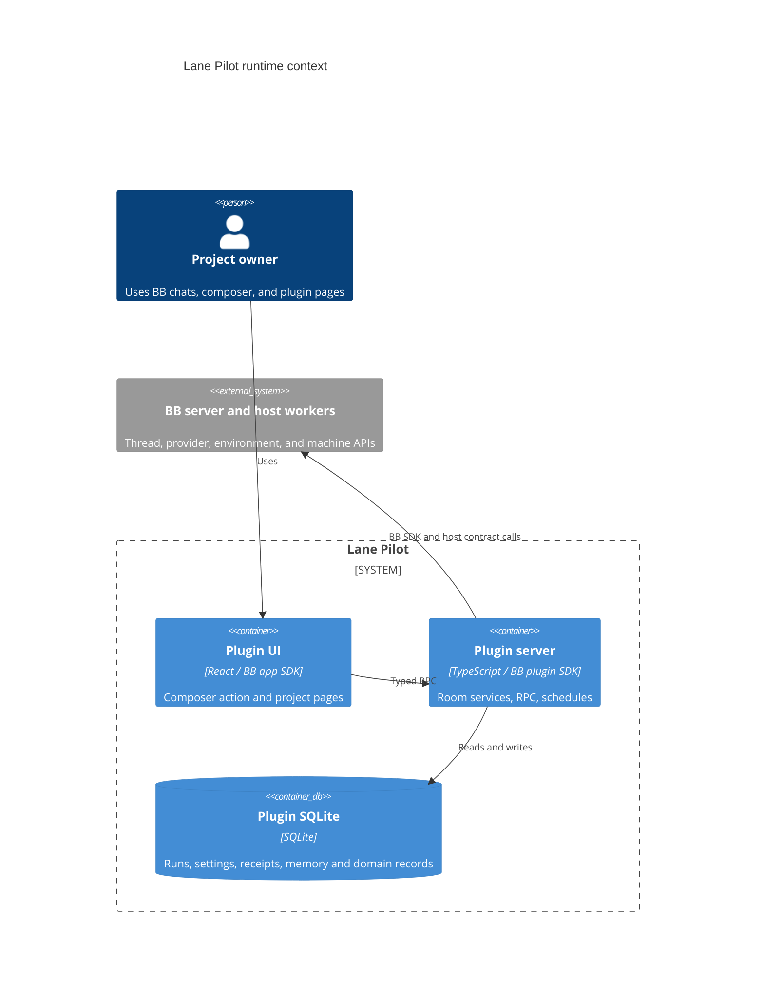

# Lane Pilot architecture

TL;DR: The BB plugin server owns SQLite and room services; the app UI and host workers communicate with it through typed RPC and host contracts.

## System context and containers

The UI and server entries are declared by the package's BB manifest (`package.json:8-18`). The server uses BB's plugin storage database and runs migrations during startup (`src/rooms/storage/database.ts:323-327`). The UI receives methods from the assembled `rpcContract`, while host calls use `hostContract` (`src/rooms/contracts/index.ts:1-26`, `src/rooms/contracts/host.ts:6-15`).

## Startup and service composition

1. BB calls `plugin(bb)`. The entry opens SQLite and installs thread signals, then creates the shared core (`server.ts:55-60`).
2. The core installs disposal state, log redaction, realtime notifications, owner-interaction handling, host RPC and background host jobs (`src/rooms/core/server/core.ts:31-49`, `:87-100`).
3. The entry mounts native message dispatch and environment hooks, then fills a shared `Services` object with room-owned factories for writer, workflow, QA, docs, memory, council, world, stability, and scheduling (`server.ts:61-91`, `src/rooms/core/server/native-wiring.ts:10-34`).
4. Lifecycle events, RPC, tools, CLI, world assets, Anamnesis, and the native worktree provider are registered after services exist (`server.ts:92-110`).
5. The entry schedules run reconciliation, silent-writer checks, and worktree cleanup (`server.ts:111-139`).

`createCore` wraps the host client with job handling and the active schedule abort signal; calls made inside an isolated schedule run carry that signal (`src/rooms/core/server/core.ts:91-100`). The service bag's shared types are defined in `src/rooms/core/server/services.ts`.

## Dependency boundaries

The supported import direction is plugin entries → room public indices → shared packages → SDK and external libraries. Rooms expose `index.ts`, `server/index.ts`, and `ui/index.ts` entry points; packages do not import `src/` (`src/rooms/core/server/core.ts:1-30`, `src/rooms/core/server/services.ts:1-20`, `package.json:55-60`). The following dependency direction is evidenced by the runtime wiring:

`server.ts` imports room server exports rather than containing room implementations (`server.ts:1-48`); the app imports UI-facing room exports (`app.tsx:1-50`). The room/package boundary test and package graph live in `tests/architecture/boundaries.test.ts` and `tests/architecture/deep-imports.json`.

## RPC composition and event wiring

`rpcContract` combines shell, native-agent, runs, settings, operations, knowledge, workflow, and world schemas (`src/rooms/contracts/index.ts:17-26`). `registerRpc` combines handlers from each room and installs one timed BB RPC registration (`src/rooms/core/server/rpc.ts:26-50`). Contracts use strict Zod input/output shapes; for example, run-list requests carry project, offset, limit and optional section (`src/rooms/contracts/rpc-runs.ts:33-40`), while the workflow contract describes drafts, tests and publication operations (`src/rooms/contracts/rpc-workflow.ts:5-90`).

`mountNativeWiring` registers the mention provider, `message.dispatch` handler, Claude environment contribution, OpenCode shim, BB shim, and retry handling for dropped provider streams (`src/rooms/core/server/native-wiring.ts:10-58`). `mountLifecycleEvents` adds event listeners only when the BB event API exists and `LANE_PILOT_THREAD_SIGNALS` is not `0`; missing event names are logged and periodic sweeps remain the fallback (`src/rooms/core/server/lifecycle-events.ts:22-37`). It closes runs when their PM thread is archived or deleted and notifies PMs when an attempt is waiting on an owner interaction (`src/rooms/core/server/lifecycle-events.ts:39-72`).

The host contract declares plugin-to-host operations including native install, git ownership and host jobs (`src/rooms/contracts/host.ts:6-25`). `runOnHost` is a typed convenience wrapper for `runCommand`; it passes the same host id in the call input and call options and defaults the transport wait to command timeout plus five seconds (`packages/host-calls/src/run-on-host.ts:8-31`).

## Data ownership

The shared SQLite migration list assembles core run tables with migrations exported by Jev, council, handoff, workflow engine, schedule, learning, and world domains (`src/rooms/storage/database.ts:30-321`). The [data model overview](data-model.md) links to domain tables. Workspace-specific tables belong to their owning package documentation, including [workflow engine](../packages/workflow-engine/docs/overview.md).

<!-- lane-pilot:backlinks -->
## Referenced by

- [Lane Pilot overview](overview.md)
- [World simulation overview](../packages/world-sim/docs/overview.md)
