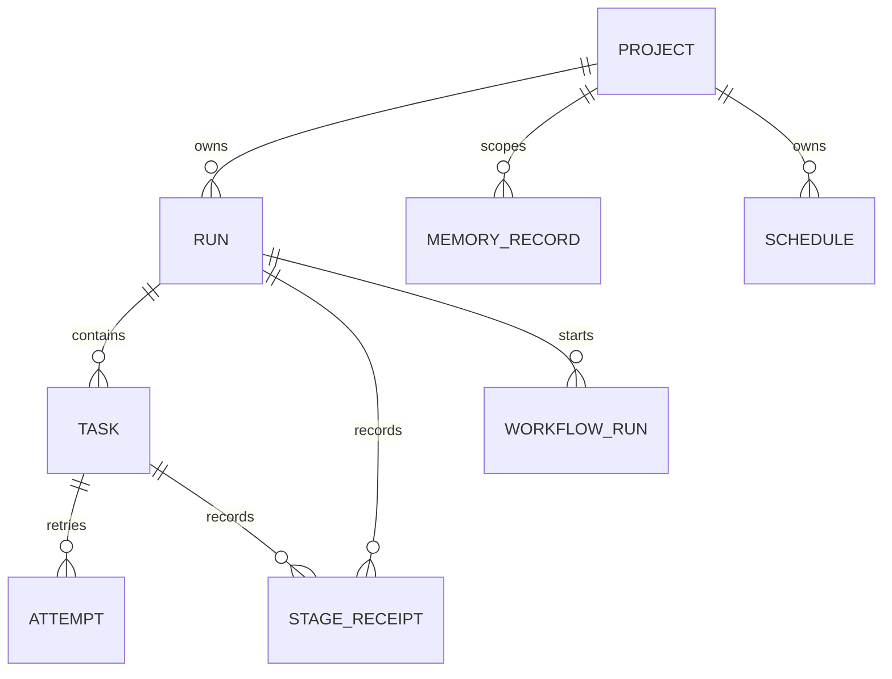

# Lane Pilot data model overview

TL;DR: Lane Pilot's server persists project settings, orchestration runs, stage evidence, knowledge and domain records in plugin SQLite; workspace-owned stores retain their own field documentation.

## Core entities

The project-scoped settings table keys values by project, optional binding, and setting key (`src/rooms/storage/database.ts:31-39`). Runs contain PM thread, state, kind and timestamps; tasks contain task-v2 contract JSON; attempts track execution state and writer thread (`src/rooms/storage/database.ts:40-73`). Stage receipts bind stage input/output hashes and result metadata to a task and run (`src/rooms/storage/database.ts:138-156`).

## Domain references

The root plugin workspace owns the following schema families:

- [Orchestration and execution](data-model/orchestration.md) — project settings, runs, tasks, attempts, receipts, gates, tokens, verification timing and secret issuance (`src/rooms/storage/database.ts:30-321`).
- [Owner profile and learning](data-model/knowledge.md) — Anamnesis record/evidence history, automatic-learning observations, items and signals (`src/rooms/anamnesis/store.ts:53-71`, `src/rooms/learning/migrations.ts:11-82`).
- [Schedules and world](data-model/automation.md) — scheduled jobs, scheduled runs, and the saved Pixel World (`src/rooms/schedule/store.ts:15-63`, `src/rooms/world/migrations.ts:1-13`).

Workspace packages document their own schema tables and columns:

- [Workflow engine data model](../packages/workflow-engine/docs/data-model.md) — journal, draft, test and trigger stores.
- [World simulation data model](../packages/world-sim/docs/data-model.md) — simulation entities, not BB plugin persistence.

The plugin's shared migration array includes stores exported by the Jev, council, handoff, run-insights, workflow engine, schedule, learning and world packages (`src/rooms/storage/database.ts:230-320`). Their data does not imply foreign-key ownership where the table definition contains no foreign key.

<!-- lane-pilot:backlinks -->
## Referenced by

- [Anamnesis and owner profile](anamnesis.md)
- [Lane Pilot architecture](architecture.md)
- [Project memory](memory.md)
- [Lane Pilot overview](overview.md)
