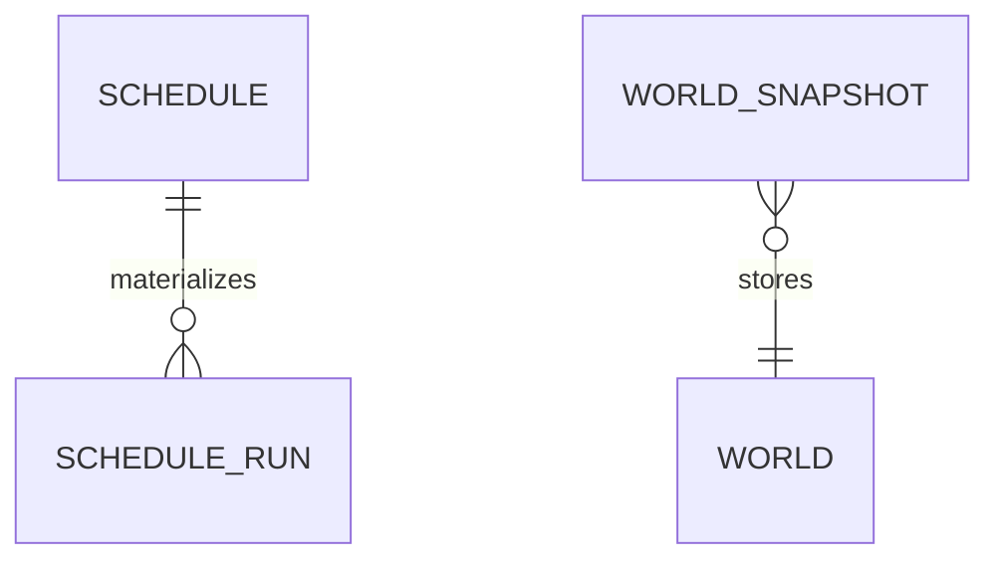

# Schedules and Pixel World persistence

TL;DR: Schedule definitions own recurrence and overlap policy; schedule run rows track each materialized execution, while Pixel World persists a single serialized simulation snapshot.

## Relationships

The schedule store defines a parent/child foreign key. The world table contains a single `main` row according to the migration's domain comment (`src/rooms/schedule/store.ts:15-60`, `src/rooms/world/migrations.ts:1-13`).

## `lane_pilot_schedule`

| Field | Meaning |
|---|---|
| `id` | Stable schedule id. |
| `project_id` | Owning BB project. |
| `name`, `description` | Owner-facing label and detail. |
| `kind` | `workflow`, `errand`, or `script`. |
| `task_json` | Serialized work definition. |
| `trigger_type` | `cron` or one-time `once`. |
| `cron`, `timezone`, `run_at` | Recurrence expression and time zone, or one-time timestamp. |
| `missed_policy` | `run_once`, `skip`, or `run_all` when a scheduled instant was missed. |
| `missed_limit` | Maximum number of missed occurrences considered. |
| `overlap` | `skip`, `queue`, or `parallel` when a previous run is active. |
| `timeout_sec`, `max_failures` | Per-run time limit and consecutive failure threshold. |
| `state` | `active`, `paused`, or `done`. |
| `pause_reason`, `consecutive_failures` | Pause explanation and failure counter. |
| `cursor_at` | Last schedule cursor time. |
| `created_by`, `created_at`, `updated_at` | Creator identity and epoch-millisecond timestamps. |

The schedule table declaration owns these constraints (`src/rooms/schedule/store.ts:15-38`). The scheduler reads policy fields when it calculates due work and overlap behavior (`src/rooms/schedule/scheduler.ts:1-70`, `:170-180`).

## `lane_pilot_schedule_run`

| Field | Meaning |
|---|---|
| `id`, `schedule_id` | Run identity and parent schedule; deleting the schedule cascades. |
| `run_key` | Unique idempotency key: schedule plus scheduled instant, or a manual nonce. |
| `scheduled_at` | Due time in epoch milliseconds. |
| `trigger` | `tick`, `catchup`, or `manual`. |
| `status` | `queued`, `running`, `waiting`, `succeeded`, `failed`, `timed_out`, `skipped`, or `canceled`. |
| `reason` | Reason for a skip or failure. |
| `queued_at`, `started_at`, `finished_at`, `deadline_at` | Execution timestamps and deadline, in epoch milliseconds. |
| `ref_kind`, `ref_id` | Type and id of related execution record. |
| `host_id` | Host assigned to the scheduled work. |
| `exit_code`, `output`, `error`, `truncated` | Process result and output handling state. |

A unique `run_key` prevents the same scheduled instant from materializing twice (`src/rooms/schedule/store.ts:11-12`, `:40-59`). Schedule runs transition from queued into active or terminal states as the scheduler dispatches and records results (`src/rooms/schedule/store.ts:71-78`, `src/rooms/schedule/scheduler.ts:170-180`).

## `lane_pilot_world`

| Field | Meaning |
|---|---|
| `id` | Primary key; the domain stores the singleton id `main`. |
| `schema` | Serialized state version. |
| `state_json` | Dynamic world state; static map is regenerated by `@lane-pilot/world-sim`. |
| `tick_at` | Wall-clock time of the last simulation tick, used to calculate restart catch-up. |
| `saved_at` | Save time in epoch milliseconds. |

The migration comment documents singleton and restart behavior (`src/rooms/world/migrations.ts:1-13`). The service writes and loads this row; plugin storage includes its migration (`src/rooms/storage/database.ts:319-320`).

## Retention and cleanup

The schedule store declares no automatic run-retention deletion; schedule deletion cascades to its run rows (`src/rooms/schedule/store.ts:40-43`). World persistence replaces the `main` snapshot as the simulation is saved; it does not persist the static map (`src/rooms/world/migrations.ts:1-13`).

<!-- lane-pilot:backlinks -->
## Referenced by

- [Lane Pilot data model overview](../data-model.md)
