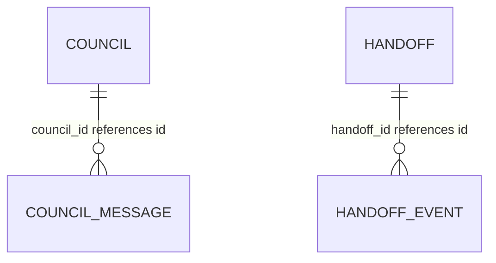

# Council, handoff, Jev and run-insight data

TL;DR: Domain stores keep council discussions, agent handoffs, Jev decision receipts, and failure-learning records in plugin SQLite.

## Relations

`lane_pilot_council_message.council_id` references `lane_pilot_council.id`, and `lane_pilot_handoff_event.handoff_id` references `lane_pilot_handoff.id`; both child rows cascade on parent deletion (`packages/council/src/store.ts:25-33`, `packages/handoff/src/store.ts:34-42`). Rule events and triage rows carry project/rule identifiers but declare no foreign key (`packages/run-insights/src/rules.ts:65-73`, `packages/run-insights/src/triage.ts:8-25`).

## Council

`lane_pilot_council` stores id, project/run, question, agenda/criteria/seats JSON, state, round counters, optional decision JSON/path/reason, and timestamps. `lane_pilot_council_message` stores ordered seat messages with round, kind, body and time; messages cascade with their council (`packages/council/src/store.ts:7-33`). Session state starts at `agenda` with round 0 (`packages/council/src/store.ts:53-57`).

| Table | Meaning |
|---|---|
| `lane_pilot_council` | `id` identifies the session; `project_id` and `run_id` scope it; `question` is the decision prompt; `agenda_json`, `criteria_json`, and `seats_json` store participant inputs; `state` is the protocol state; `round` and `max_rounds` count discussion rounds; `decision_json`, `decision_path`, and `reason` record an optional result; `created_at` and `updated_at` are epoch milliseconds. |
| `lane_pilot_council_message` | `seq` orders messages; `council_id` references the session; `seat_id` identifies the speaker; `round` is the discussion round; `kind` classifies the message; `text` is its body; `at` is epoch milliseconds. |

| Status field | Transitions |
|---|---|
| `lane_pilot_council.state` | Created as `agenda`; council runner advances it through protocol states and terminal decision (`packages/council/src/store.ts:53-57`, `packages/council/src/contract.ts:1-30`). |

## Handoff

`lane_pilot_handoff` stores project/run, sender and recipient, owner/recipient threads, state, serialized card and receipt, lease holder/expiry, deadline and timestamps. `lane_pilot_handoff_event` is its transition trail and cascades with the card (`packages/handoff/src/store.ts:16-42`).

| Table | Meaning |
|---|---|
| `lane_pilot_handoff` | `id` identifies the handoff; `project_id` and optional `run_id` scope it; `from_agent` and `to_agent` identify participants; optional owner/recipient thread ids locate chats; `state` is the handoff state; `card_json` and optional `receipt_json` store request and result; `lease_holder` and `lease_expires_at` identify the lease and its epoch-millisecond expiry; `deadline_at` is an optional epoch-millisecond deadline; `created_at` and `updated_at` are epoch milliseconds. |
| `lane_pilot_handoff_event` | `id` orders events; `handoff_id` references the handoff; `from_state` may be empty at creation; `to_state` is the new state; `actor` identifies who changed it; `note` is optional context; `occurred_at` is epoch milliseconds. |

| Status field | Transitions |
|---|---|
| Handoff state | Contract transition rules validate moves; terminal completion releases the lease, and expired deadlines are handled by the store (`packages/handoff/src/contract.ts:1-30`, `packages/handoff/src/store.ts:14-42`). |

## Jev receipt

`lane_pilot_jev_receipt` stores judgment/version/model/mode, optional project/run/subject, input hash and character count, question/batch counts, status, summarized answers, decision source, escalation target, thresholds, latency milliseconds, token counts and outcome labels (`packages/jev/src/receipts.ts:9-39`). It deliberately stores a hash and size instead of the state text (`packages/jev/src/receipts.ts:5-7`). Status values are `ok`, `disabled`, `timeout`, `error`, `breaker_open`, `budget`, and `invalid`; decision source is `jev`, `fallback`, or `escalated` (`packages/jev/src/receipts.ts:21-27`).

| Table | Meaning |
|---|---|
| `lane_pilot_jev_receipt` | `id` identifies the receipt; `judgment` and `version` identify the rule; `model` may be absent; `mode` is `shadow` or `active`; project/run/subject are optional scope; `input_sha256` and `input_chars` identify input without storing it; `questions` and `batch_size` count judgment work; `status` and `decided_by` use the values above; answer, threshold, decision, and escalation fields capture the verdict; `latency_ms` is milliseconds and token fields count tokens; `outcome` and `outcome_at` record later evaluation; `at` is epoch milliseconds. |

## Failure triage and rule proposals

| Table | Meaning | Lifecycle |
|---|---|---|
| `lane_pilot_failure_triage` | `project_id` and `attempt_id` identify the project failure; `run_id` and `task_id` locate its work; `reason_sha256` and `reason` preserve a normalized failure; `origin` and `category` use the triage vocabularies, with confidence probabilities; `same_rule_id` identifies a matching rule; `status` is `ok` or `error`; `detail` explains a triage error; `failed_at` and `triaged_at` are epoch milliseconds. | Status: `ok` or `error`; one row per `(project_id,attempt_id)` (`packages/run-insights/src/triage.ts:8-25`). |
| `lane_pilot_rule_proposal` | `project_id`, `id`, and `signature` identify the proposal; `rule` is its instruction; `author` is `sweep`, `pm`, `owner`, or `model`; `state` is `proposed`, `accepted`, `rejected`, or `revoked`; `occurrences` and `task_count` count supporting failures; `examples_json` and `evidence_json` carry examples and task references; `memory_id` links optional memory; `first_seen_at`, `last_seen_at`, `updated_at`, `decided_at`, and `revision_started_at` are epoch milliseconds; `trial_state`, `revision`, and `retired_reason` track trials; `scope_json` records section scope; `audience` is `writer`, `pm`, or `both`; `always_on` is a boolean integer. | States: `proposed`, `accepted`, `rejected`, `revoked`; author is `sweep`, `pm`, `owner`, or `model` in the current definition (`packages/run-insights/src/rules.ts:9-24`, `:27-50`, `:60-85`). |
| `lane_pilot_rule_event` | `id` is the event key; `project_id` and `rule_id` identify the proposal; `action` names the event; `detail` carries optional event data; `at` is epoch milliseconds. | Append event on proposal, trial and owner action (`packages/run-insights/src/rules.ts:65-73`). |

## Writers, readers and retention

Council and handoff stores are written by their respective domain services and read by their UI/agent services (`packages/council/src/store.ts:53-57`, `packages/handoff/src/store.ts:68-75`). Jev creates receipts per judgment when a database is supplied (`packages/jev/src/run.ts:66-79`). Rule and triage services write rows from task failures and the lessons sweep reads them (`packages/run-insights/src/rules.ts:5-8`, `packages/run-insights/src/triage.ts:5-8`). Jev retains a bounded receipt set of 50,000 rows (`packages/jev/src/receipts.ts:50`).
