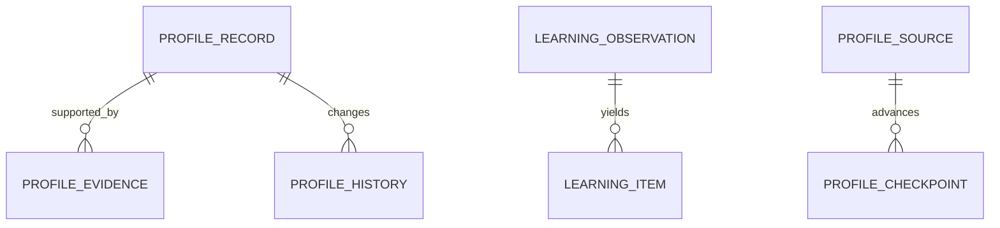

# Owner profile and learning data

TL;DR: Anamnesis stores evidence-backed profile records; learning stores masked owner-message observations, extracted learning items, and signals from other sources.

## Relationships

The Anamnesis store creates its own SQLite tables (`src/rooms/anamnesis/store.ts:52-72`); learning tables are appended to the plugin database migrations (`src/rooms/learning/migrations.ts:1-10`).

## Anamnesis tables

| Table | Meaning | Invariants and lifecycle | Writers and readers |
|---|---|---|---|
| `records` | `id`; record `kind`; display `title`; `statement`; structured `attributes`; `sensitivity`; confidence score; status; first/last evidence times; manual edit time; created/updated times. | Status and sensitivity are domain values; record id is primary key. Evidence changes also create history (`src/rooms/anamnesis/store.ts:53-57`). | Collectors and owner edits write; profile, annual review and UI read. |
| `evidence` | `record_id`; source name; source reference; evidence time; optional quote. | Composite key `(record_id,source,ref)`; deleting record cascades evidence (`src/rooms/anamnesis/store.ts:58-61`). | Source imports write; profile review and evidence display read. |
| `history` | Event id; record id; time; actor; action; reason; JSON changes. | Append-oriented audit history indexed by record (`src/rooms/anamnesis/store.ts:62-65`). | Mutations write; record history view reads. |
| `tombstones` | Forgotten record id and cutoff timestamp. | One cutoff per id (`src/rooms/anamnesis/store.ts:66`). | Forget operation writes; source reconciliation avoids resurrecting forgotten records. |
| `checkpoints` | Source key; cursor time; detail JSON; update time. | One cursor per source (`src/rooms/anamnesis/store.ts:67`). | Collection writes after a run-mode import (`src/rooms/anamnesis/collect.ts:54-57`); next scan reads. |
| `sources` | Source key; enabled flag; change time. | One enabled flag per source (`src/rooms/anamnesis/store.ts:68`). | Owner settings write; collector checks before scanning (`src/rooms/anamnesis/collect.ts:45-48`). |
| `loads` | Load id; time; mode; JSON report. | Records preview and run import outcomes (`src/rooms/anamnesis/store.ts:69`). | Collector writes; load history view reads. |
| `notes_files` | File path; content hash; write time. | One hash per notes file (`src/rooms/anamnesis/store.ts:70`). | Notes exporter writes; incremental sync reads. |
| `notes_lines` | Record id; target file; rendered line. | One line mapping per record (`src/rooms/anamnesis/store.ts:71`). | Notes exporter writes; update/remove reconciliation reads. |

## Learning tables

| Table | Meaning | State lifecycle and invariants | Writers and readers |
|---|---|---|---|
| `lane_pilot_learning_obs` | Id; thread/project; message and judgment times; source; character count; masked excerpt; skip/sensitivity flags; Jev and second-opinion judgments; routed kind/probabilities; temporary masked body/previous message; review result/time. | State: `skipped`, `observed`, `candidate`, `extracted`, `ignored`. Sensitive observations store no message body; waiting body fields are cleared after extraction or after a day (`src/rooms/learning/migrations.ts:4-6`, `:11-45`). | Owner message hook writes; extraction and housekeeping read/update. |
| `lane_pilot_learning_item` | Id and source observation; project/thread; item kind; text; audience/reach; due time; state; target; evidence; duplicate id; confirmation count; note; created/decision/announcement times. | Kind: `rule`, `preference`, `decision`, `deadline`, `fact`; state: `adopted`, `proposed`, `pending_owner`, `accepted`, `duplicate`, `rejected`, `dropped`, `noted` (`src/rooms/learning/migrations.ts:49-68`). | Extractor writes; learning digest, owner confirmation and rule adoption read/update. |
| `lane_pilot_learning_signal` | Id; signal kind; optional project; reference; confidence probability; detail; state; event time. | Unique `(kind,ref)` prevents duplicate signal rows; initial state `observed` (`src/rooms/learning/migrations.ts:71-81`). | Signal collectors write; daily learning pass reads. |

## Project memory

| Table | Meaning | Lifecycle and invariants | Writers and readers |
|---|---|---|---|
| `lane_pilot_memory` | `id` stable record key; `project_id` and `personal_bot` scope; `kind` (`core`/`note`); `audience` (`owner`/`subagent`/`export`); `content`; `concepts_json`; source SHA-256; creation time; `status`; replacement id; optional validity deadline; last-used time; use and accepted counts; `trust` (`confirmed`/`observed`); `origin`; optional source file id. | Status values are `active`, `superseded`, and `expired` (`src/rooms/storage/database.ts:282-290`). Active records become superseded when replaced or expired by validity/idle/budget; an expired matching record can be revived when restated (`packages/memory-core/src/store.ts:103-109`, `:113-126`, `:157-161`; `packages/memory-core/src/lifecycle.ts:16-20`). | Session, maintainer, rule, and file import writers store records; retrieval, maintenance, and accepted-attempt accounting read/update them (`packages/memory-core/src/store.ts:83-93`, `:147-168`; `packages/memory-core/src/lifecycle.ts:71-80`). |
| `lane_pilot_memory_fts` | `id` and `project_id` scope FTS rows; `content` and `concepts` are indexed text. | FTS5 index is updated with record inserts and removals; trigram search index is created on first use when the SQLite tokenizer exists (`src/rooms/storage/database.ts:168`, `packages/memory-core/src/store.ts:36-66`). | Memory store maintains the index; project memory search reads it and falls back to a code scan when trigram support is unavailable (`packages/memory-core/src/store.ts:36-55`, `:58-66`). |

| Status or trust transition | Function and condition |
|---|---|
| `active` → `superseded` | `storeMemoryRecords` replaces a same-file or explicitly superseded record, or an older same-subject note (`packages/memory-core/src/store.ts:113-126`). |
| `active` → `expired` | `expireMemory` hides expired validity and idle notes; note-budget eviction uses the same status (`packages/memory-core/src/lifecycle.ts:16-20`, `packages/memory-core/src/store.ts:134-145`). |
| `expired` → `active` | A matching record is revived when its fact is stated again or its source file provides it again (`packages/memory-core/src/store.ts:103-109`, `:157-161`). |
| `observed` → `confirmed` | A second independent source corroborates the same observed record (`packages/memory-core/src/store.ts:103-105`, `:163`). |

## Status transitions

| From | To | Function and condition |
|---|---|---|
| Observation | Initial `observed`; policy skip becomes `skipped`; active learn route becomes `candidate`; shadow/inactive route remains `observed` | `createObserver.observe` chooses the state and inserts the observation (`src/rooms/learning/observe.ts:80-95`, `:113-126`). |
| Observation | `candidate` → `extracted` or `ignored` | `finishCandidates` clears body and previous-message text after extraction or a rejected read; `purgeStaleBodies` marks unread candidates `ignored` after the retention window (`src/rooms/learning/store.ts:71-80`). |
| Learning item | Initial `dropped`, `pending_owner`, `noted`, `duplicate`, `proposed`, or `adopted` | `route` chooses the initial state from kind, comparison result, reach and rule adoption (`src/rooms/learning/extract.ts:175-208`). |
| Learning item | `pending_owner` / `proposed` → `accepted`, `rejected`, `adopted`, or `proposed` | `accept` stores owner-approved reminders/memory or adopts a rule; `reject` and `drop` set their terminal owner decision (`src/rooms/learning/decide.ts:45-80`, `:84-91`). |

## Retention

Learning migration comments specify that masked `body` and `prev` fields are cleared when read or after one day; sensitive observations keep neither (`src/rooms/learning/migrations.ts:4-6`). Project memory notes not used for 90 days expire; observed records wait 24 hours for a second source before writer use (`packages/memory-core/src/lifecycle.ts:4-7`). Housekeeping for observation rows is implemented in `src/rooms/learning/housekeeping.ts`.

<!-- lane-pilot:backlinks -->
## Referenced by

- [Lane Pilot data model overview](../data-model.md)
