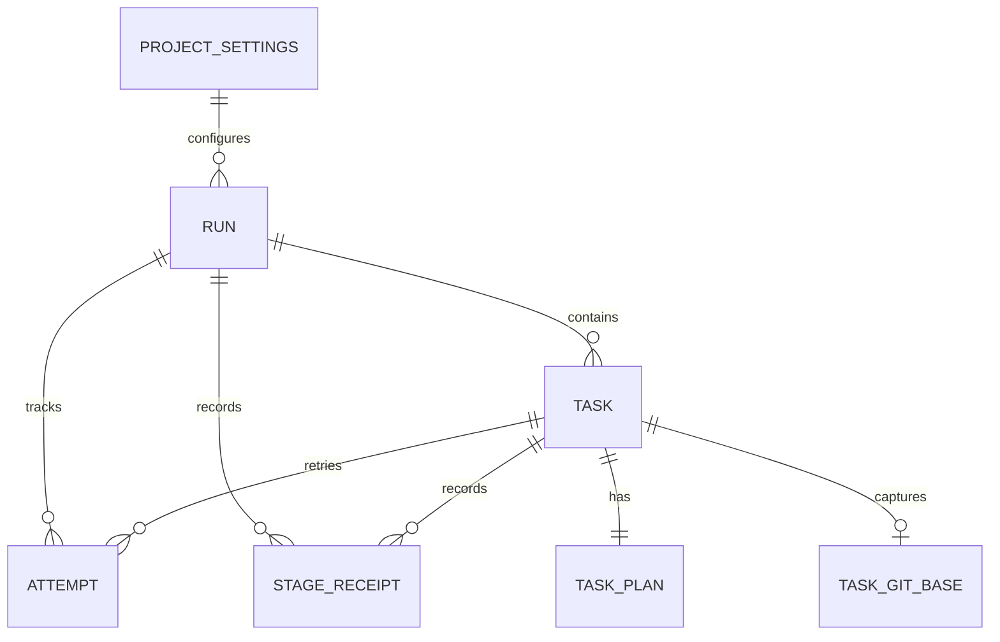

# Orchestration and execution data

TL;DR: Core orchestration tables hold project settings, run/task/attempt state, immutable stage and gate evidence, token usage, check timing, and secret issuance metadata.

## Relationships

Tables are created or extended in the ordered plugin migration list (`src/rooms/storage/database.ts:30-156`, `:169-229`).

## Table meanings

| Table | Meaning | Lifecycle and invariants | Writers and readers |
|---|---|---|---|
| `lane_pilot_project_settings` | `project_id` project scope; `binding_id` workspace binding or empty default; `key` setting name; `value` serialized setting; `version` optimistic revision; `updated_at` epoch milliseconds. | Primary key is `(project_id,binding_id,key)`; empty binding is the project-level value (`src/rooms/storage/database.ts:31-39`). | Settings APIs write; core and room settings readers load it. |
| `lane_pilot_setting_generation` | `project_id`, `binding_id`, `key` identify a setting; `version` is its generation counter. | Composite primary key; initialized from existing settings versions (`src/rooms/storage/database.ts:219-227`). | Settings mutation code writes; version-aware UI/RPC reads. |
| `lane_pilot_run` | `id`; `project_id`; `pm_thread_id`; `state`; creation/update times; `kind` (`bb`/`cli`); `closed_at`, `closed_by`; writer workspace/environment/host; run policy and gate; helper policy; settings scopes; objective. | States: `pending`, `running`, `accepted`, `blocked`, `closed`; migration rebuild maps a non-null `closed_at` to `closed` (`src/rooms/storage/database.ts:40-47`, `:78-94`, `:211-229`). | Activation and run transitions write; runs UI, reconciler and scheduler read. |
| `lane_pilot_task` | `id`; parent `run_id`; `kind` (`bb`/`cli`); serialized task-v2 `contract_json`; `created_at`. | `run_id` references run; task id is the stable task key (`src/rooms/storage/database.ts:60-67`). | Writer dispatch writes; runs, reconciliation, acceptance and memory stages read. |
| `lane_pilot_attempt` | `id`, `run_id`, `task_id`, writer `thread_id`, `state`, `reason`, creation/update times, attempt number, pre-attempt dirt JSON, workspace/environment/decision JSON, holder thread, harness version. | `run_id` references a run. `attempt_no` defaults to 1; current state transitions are separately recorded (`src/rooms/storage/database.ts:48-59`, `:75-77`, `:169-171`, `:216-217`, `:273`). | Dispatch and reconciliation write; writer, run UI, stability and acceptance read. |
| `lane_pilot_activation` | `project_id`; PM thread; run id; claim time. | One active activation claim per project by primary key (`src/rooms/storage/database.ts:68-73`). | Activation writes; activation reconciliation reads. |
| `lane_pilot_attempt_reasoning` | `attempt_id`; `trace_json` for provider/model/reasoning decision trace. | Attempt foreign key cascades on deletion (`src/rooms/storage/database.ts:128-132`). | Writer selection writes; run receipts and UI read. |
| `lane_pilot_task_plan` | `task_id`; canonical plan text. | Task foreign key cascades on deletion (`src/rooms/storage/database.ts:133-137`). | Dispatch writes; retry and Jev adapter read. |
| `lane_pilot_stage_receipt` | `run_id`, `task_id`, `stage_id`; contract version; state; input/output SHA-256; attempt index; provider/model/thread; result JSON, reason, update time. | State set: `pending`, `running`, `passed`, `failed`, `blocked`, `skipped`, `canceled`; attempt is 0–2; composite key identifies a stage per task (`src/rooms/storage/database.ts:138-156`). | Stage runner writes; run monitor, retry, memory and acceptance read. |
| `lane_pilot_stage_event` | Event id; project/run/task/stage; state; input/output hashes; attempt; occurrence time. | Append-only trigger rejects updates and deletes; state and attempt values match stage receipt (`src/rooms/storage/database.ts:172-186`). | Stage transition recorder writes; analytics reads. |
| `lane_pilot_gate_event` | Event id; project/run/task; gate; status; hashes; attempt; occurrence time. | Gates are `owns-paths`, `validate`, `accept`, `verification`; statuses are `passed`, `rejected`, `failed`, `skipped`; append-only trigger blocks mutation (`src/rooms/storage/database.ts:187-201`). | Ownership, validation, acceptance and verification code write; monitor/analytics read. |
| `lane_pilot_task_git_base` | Task id; base ref and SHA; initial head SHA; branch; committed-diff flag; capture time. | One row per task; `compare_committed` is 0 or 1 (`src/rooms/storage/database.ts:202-210`). | Workspace setup writes; ownership and acceptance compare against it. |
| `lane_pilot_attempt_transition` | Attempt id; previous and next state; reason; refused flag; timestamp. | Transition history is append-only by usage; refusal flag defaults to 0 (`src/rooms/storage/database.ts:955-985`). | Attempt transition helper writes; run diagnostics reads. |
| `lane_pilot_token_daily` | UTC day; project/provider/model; input, output, cached, total, uncached, cache-read and cache-write token counts. | Composite primary key `(day,project_id,provider_id,model)`; counts are token units (`src/rooms/storage/database.ts:245-270`). | Usage importer aggregates; usage screens and Pixel World inputs read. |
| `lane_pilot_token_cursor` | Thread id; project/provider; last sequence and event JSON; cumulative JSON; last model/provider/turn; update time. | One cursor row per thread (`src/rooms/storage/database.ts:256-267`). | Usage event ingestion writes; replay/recovery reads. |
| `lane_pilot_check_duration` | Project id; normalized command key; duration milliseconds; exit code; event time. | Rows record observed command runs; duration unit is milliseconds (`src/rooms/storage/database.ts:275-277`). | Verification writes; adaptive timeout selection reads. |
| `lane_pilot_secret_issuance` | Id; time; project/run/task; consumer; thread; check command; secret name; host id; network. | Stores names and routing metadata, not secret values (`src/rooms/storage/database.ts:300-314`). | Secret resolver writes; audit and security review reads. |

## Status transitions

| From | To | Writer and condition |
|---|---|---|
| Attempt state | Next attempted state | `transitionAttempt` checks legal moves and records each accepted or refused transition (`src/rooms/storage/database.ts:955-985`; `src/rooms/writer/server/dispatch.ts:12`). |
| Stage receipt state | `pending` → `running` → terminal | Stage runners write a unique `(run, task, stage)` receipt; stage events preserve change history (`src/rooms/storage/database.ts:138-186`). |
| Run state | `pending` → `running` → `accepted` or `blocked`; then `closed` | Run state transitions and abandonment handling use run storage helpers (`src/rooms/storage/database.ts:40-47`, `:78-94`). |

## Retention and cleanup

This migration file defines cleanup for obsolete in-memory lesson rows and orphaned FTS entries, not a general TTL for orchestration rows (`src/rooms/storage/database.ts:235-238`). Finished attempt workspaces and sticky lane worktrees are cleaned by scheduled jobs in the plugin entry (`server.ts:111-125`).

<!-- lane-pilot:backlinks -->
## Referenced by

- [Lane Pilot data model overview](../data-model.md)
