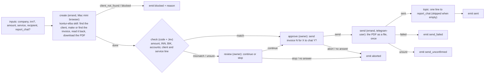

# invoice-send: an invoice in Kontur.Elba, checked, approved and sent

`workflows/invoice-send.json`, status **tested** (on stubs: `tests/workflow/chains-invoice.test.ts`, `tests/jev/invoice-check.test.ts`). It becomes
published after one successful live run. Nothing is sent without the owner's «send».

## Inputs and result

| Input | |
| --- | --- |
| `company` (required) | the client as it is in Elba: name or INN. The client must exist; the chain never creates a client or a contract |
| `inn` | the INN when the owner gave it: it is then compared with the invoice |
| `amount` (required) | the total in RUB, exactly as it must stand in the invoice (final, never recalculated) |
| `service` (required) | what the invoice is for, in the owner's words |
| `recipient` (required) | the Telegram chat that gets the PDF: `@username`, a numeric id, a link, or `me` (Saved Messages) |
| `report_chat` | a chat or project topic for a one-line report after the send; empty: none |

Mail is not offered: there is no mail skill. The result: `status` (`sent`, `aborted`, `blocked`, `send_failed`, `send_unconfirmed`), `invoice_number`,
`invoice_url`, `pdf_path` (on the Mini), `message_id`, `check_verdict`, `reason`.

## The check (`invoice.check`, src/jev/judgments/invoice-check.ts)

Code decides what code can: the invoice has a number and an amount, the amount equals the request (to half a kopeck), the client's INN has valid control
digits and equals the request's `inn`, the BIK is a Russian one, the payment and correspondent accounts have valid control digits for that BIK. Jev is
asked two questions about names only (the state it sees is the two client names and the two service lines, never an amount or a bank detail): is the
client the same company, is the service line the same work. Both sure: `match`; one clearly different or a hard check failed: `mismatch`; otherwise `unsure`.
Thresholds `invoice.check.min_same` (0.8) and `invoice.check.max_different` (0.25) in the project setting `jev.thresholds`; the mode (`active`) in `jev.modes`.
With Jev off or unreachable the deterministic rule answers (a match needs the words of the names and of the service lines to agree). Receipts:
`lane_pilot_jev_receipt` where `judgment='invoice.check'`.

## Live run: the exact steps (needs the owner's real test invoice; do not do this from an agent)

Before: the build with this chain is on the hub; the project has an open Lane Pilot PM chat; on the Mac mini (`host_7sea4qaad8`) the Elba session works
(`browser-cookies sync elba`, open `https://elba.kontur.ru` in the headless session: the organization is selected, no login form), `~/toolkit/telegram/tg`
is logged in; there is a test client in Elba whose invoices the owner is happy to cancel.

1. Preflight: Workflows tab, invoice-send, or `bb plugin rpc call lane-pilot workflow_preflight --input '{"id":"invoice-send","projectId":"<project>"}'`. Every line must be ok (skills `kontur-elba`, `browser-automation`, `telegram-user`, the plugin `browser-automation`, the tools).
2. Start it as a first live run (the chain is `tested`, so this needs `liveTrial`): the **Run for real** button of the Workflows tab with
   `company` = the test client, `inn` = its INN, `amount` = `100`, `service` = `Тест Lane Pilot`, `recipient` = `me`, `report_chat` empty; or
   `bb plugin rpc call lane-pilot workflow_run --input '{"id":"invoice-send","projectId":"<project>","liveTrial":true,"inputs":{"company":"<client>","inn":"<inn>","amount":100,"service":"Тест Lane Pilot","recipient":"me"}}'`.
3. Watch `workflow_run_snapshot` (the run id comes back): `create` takes minutes in the browser; `check` is instant. Read its output: `verdict`, `reasons`, `by`.
4. A form opens in the project's PM chat (and on the phone): the review (only if the check was not clean) and then «Send invoice N for 100 RUB to … to Telegram chat me?». Answer **send**.
5. Check the result against the sources: the PDF arrived in Saved Messages with the caption; open the invoice in Elba and compare number, total, service line, client and the payment details with the PDF and with the run's output (`invoice_number`, `invoice_url`, `pdf_path`).
6. Run it a second time with the same inputs and answer **abort**: the Elba step must find the invoice of the first run (same client, same amount, same day) and not make a duplicate, and nothing is sent (`status: aborted`). The review path (a check that is not clean) is covered on stubs only; it cannot be provoked live, because the Elba step makes the invoice with the requested amount.
7. A success makes the chain **published** (status in the Workflows tab). Cancel or delete the test invoice in Elba (do not mark it paid or signed).
8. Look at what Jev did: `SELECT mode, status, decided_by, decision, answers_json FROM lane_pilot_jev_receipt WHERE judgment='invoice.check' ORDER BY id DESC LIMIT 5` on the hub's plugin database.

If a step fails: `create` blocked with a login wall means the Mini session expired (sync the cookies again, no password is asked or stored); `client_not_found` means the
search did not give exactly one client; `send_unconfirmed` means read the chat before anything is sent again.

## Scheduling it

Once published, the schedule board can run it: a task `{"kind":"workflow","workflowId":"invoice-send","inputs":{...}}` with `when` `{"type":"cron","cron":"0 10 1 * *","timezone":"Europe/Moscow"}`.
A scheduled run still asks the owner before the send; it waits in the «waiting for you» column (up to 72 hours, then it is given up and nothing is sent), and the
overlap policy `skip` keeps a second month from starting while the first waits.
