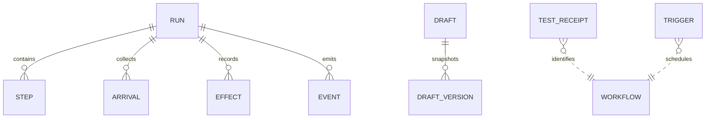

# Workflow Engine Data Model
TL;DR: The workspace stores execution journals, workflow drafts and version snapshots, and test/trigger metadata in SQLite tables registered through host migrations.

## Schema overview

The journal tables are defined in `workflowMigrations`, draft tables in `draftMigrations`, and test receipt/trigger tables in `workflowOpsMigrations` (`packages/workflow-engine/src/journal.ts:10-105`, `packages/workflow-engine/src/draft-store.ts:9-38`, `packages/workflow-engine/src/ops-store.ts:14-39`). The schema has logical links but does not declare foreign-key constraints in these migrations.

## Domain areas

- [Run journal](data-model/run-journal.md): run, step, branch-arrival, effect, and append-only event records.
- [Drafts and operational metadata](data-model/drafts-operations.md): current draft, version snapshots, test receipts, and schedule-trigger association.

The storage room appends these migrations to the host database migration list; this package does not open or own a database file (`src/rooms/storage/database.ts:293-297`, `packages/workflow-engine/src/db.ts:1-4`).

<!-- lane-pilot:backlinks -->
## Referenced by

- [Workflow Engine — Overview](overview.md)
