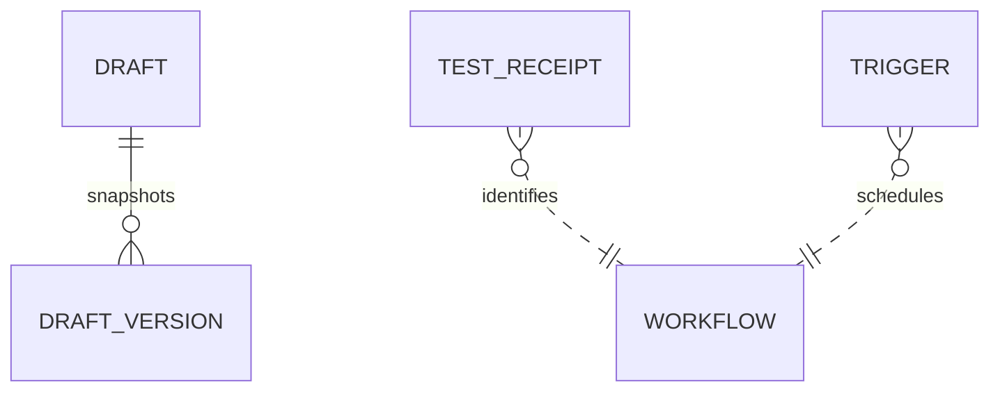

# Workflow Draft and Operations Data
TL;DR: Draft records hold editable workflow content and snapshots; operational rows bind exact workflow hashes to test receipts and schedule automation records.

## Relationships

Workflow associations in operational tables use IDs and hashes, not declared foreign keys (`packages/workflow-engine/src/draft-store.ts:11-38`, `packages/workflow-engine/src/ops-store.ts:14-39`).

## Tables

### `lane_pilot_wf_draft`

Purpose: Current editable workflow, project/thread ownership, status, tests, and published-file pointer (`packages/workflow-engine/src/draft-store.ts:11-27`).

| Field | Meaning |
|---|---|
| `id` | Draft ID primary key; generated with `wfd_` prefix. |
| `project_id` | Owning project ID. |
| `thread_id` | Optional creating/editing conversation thread. |
| `scope` | `global` or `project`. |
| `workflow_id` | Workflow identifier represented by this draft. |
| `status` | `draft`, `tested`, or `published`; defaults to `draft`. |
| `version` | Current edit version, starting at 1. |
| `definition_json` | Current serialized workflow definition. |
| `tests_json`, `tested_version` | Nullable test results and version they cover. |
| `published_version`, `published_path`, `published_sha256` | Nullable workflow version, file path, and content hash recorded at publication. |
| `created_at`, `updated_at` | Millisecond timestamps. |

Status lifecycle:

| From | To | Function | When |
|---|---|---|---|
| New | `draft` | `create` (`packages/workflow-engine/src/draft-store.ts:94-109`) | Initial draft row is inserted. |
| Any editable status | `draft` | `patch`, `restore` (`packages/workflow-engine/src/draft-store.ts:138-145`, `packages/workflow-engine/src/draft-store.ts:148-161`) | Definition changes or prior version is restored. UI-only changes keep status. |
| `draft` | `tested` or `draft` | `recordTests` (`packages/workflow-engine/src/draft-store.ts:165-173`) | Current version has nonempty complete all-green results, else status remains draft. |
| Matching current version | `published` | `markPublished` (`packages/workflow-engine/src/draft-store.ts:176-179`) | Caller records the published file metadata. |

Invariants: scope/status are SQL-constrained; draft edits use version checks; project listing is ordered by update time (`packages/workflow-engine/src/draft-store.ts:11-28`, `packages/workflow-engine/src/draft-store.ts:112-117`). The resolver separately requires a green receipt for the exact current file hash before an owner-authored `tested` or `published` file counts as tested/published (`packages/workflow-engine/src/ops-store.ts:45-52`, `packages/workflow-engine/src/ops-store.ts:76-89`).

Writers/readers: `createDraftStore` writes and reads draft rows; workflow editor/library code uses it. No draft cleanup or retention function is defined in this workspace (`packages/workflow-engine/src/draft-store.ts:81-190`).

### `lane_pilot_wf_draft_version`

Purpose: Definition snapshot and operation summary for each draft version (`packages/workflow-engine/src/draft-store.ts:29-37`).

| Field | Meaning |
|---|---|
| `draft_id`, `version` | Composite primary key identifying the snapshot. |
| `definition_json` | Full definition snapshot at that version. |
| `summary` | Creation, edit summary, or restore description. |
| `ops_json` | Nullable serialized operations that produced the snapshot. |
| `at` | Snapshot timestamp in milliseconds. |

Invariants: `(draft_id,version)` is primary key; restore creates a new version rather than overwriting prior history (`packages/workflow-engine/src/draft-store.ts:29-37`, `packages/workflow-engine/src/draft-store.ts:148-161`). Draft creation, patch, and restore write snapshots; `history` and `definitionAt` read them (`packages/workflow-engine/src/draft-store.ts:104-108`, `packages/workflow-engine/src/draft-store.ts:182-188`). No retention job is defined.

### `lane_pilot_wf_test`

Purpose: Test receipt keyed by workflow ID and exact definition SHA-256 (`packages/workflow-engine/src/ops-store.ts:14-23`).

| Field | Meaning |
|---|---|
| `workflow_id`, `definition_sha256` | Composite key for workflow content tested. |
| `green` | Integer boolean: 1 for green, 0 otherwise. |
| `results_json` | Serialized test results. |
| `at` | Receipt timestamp in milliseconds. |

No status lifecycle field. `recordTest` upserts receipts; `resolve` checks the exact hash (with legacy hash fallback), and `liveSuccess` reads successful top-level run rows to lift a `tested` workflow to `published` (`packages/workflow-engine/src/ops-store.ts:50-89`). No cleanup job is defined.

### `lane_pilot_wf_trigger`

Purpose: Maps one workflow/project/schedule slot to a host automation and the signature used to create it (`packages/workflow-engine/src/ops-store.ts:24-34`).

| Field | Meaning |
|---|---|
| `workflow_id`, `project_id`, `slot` | Composite primary key for workflow schedule slot. |
| `automation_id` | Host automation identifier. |
| `signature` | Source configuration signature used for synchronization. |
| `created_at`, `updated_at` | Millisecond timestamps. |

No lifecycle status field. The workflow trigger integration writes and reads these associations; this workspace defines the table and migration only (`packages/workflow-engine/src/ops-store.ts:24-34`). No retention job is defined.

<!-- lane-pilot:backlinks -->
## Referenced by

- [Workflow Engine Data Model](../data-model.md)
