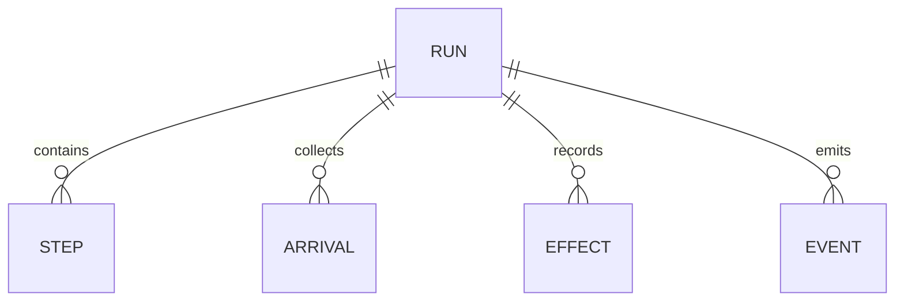

# Workflow Run Journal Data
TL;DR: The run journal records each workflow run, executable step, join arrival, external effect, and state-change event needed for execution, inspection, and recovery.

## Relationships

These are logical associations by `run_id`; migrations do not declare foreign keys (`packages/workflow-engine/src/journal.ts:11-105`).

## Tables

### `lane_pilot_wf_run`

Purpose: One execution instance, its immutable workflow snapshot, linkage to parent/task/project records, budgets and usage, lease owner, and final output (`packages/workflow-engine/src/journal.ts:11-39`).

| Field | Meaning |
|---|---|
| `id` | Run identifier; primary key. |
| `idem_key` | Optional unique idempotency key supplied by caller. |
| `workflow_id`, `workflow_version`, `workflow_sha256`, `definition_json` | Workflow identity and definition snapshot used by the run. |
| `project_id`, `link_run_id`, `link_task_id`, `link_attempt_id` | Optional host-side project/task/run attribution. |
| `parent_run_id`, `parent_step_key`, `depth` | Parent workflow/step and nested-run depth; depth defaults to 0. |
| `status` | `running`, `waiting`, `succeeded`, `failed`, `blocked`, `interrupted`, or `canceled`. |
| `reason`, `mode` | Optional terminal/wait reason and quality mode. |
| `inputs_json`, `output_json` | JSON workflow input and nullable output. |
| `harness_version` | Host build stamp recorded for the run. |
| `steps_used`, `tokens_used` | Usage counts, default 0. |
| `cost_micro_usd` | Run cost in millionths of a US dollar, default 0. |
| `wait_ms` | Accumulated wait duration in milliseconds, default 0. |
| `owner_id`, `lease_until` | Current engine owner and lease expiry timestamp in milliseconds. |
| `created_at`, `updated_at` | Millisecond timestamps supplied by the engine clock. |
| `goals_json` | Added by operations migration; serialized run goals, nullable. |

Status lifecycle:

| From | To | Function | When |
|---|---|---|---|
| New | `running` | `WorkflowEngine.start` (`packages/workflow-engine/src/engine.ts:258-263`) | A new run row is created. |
| `running` | `waiting` | Driver (`packages/workflow-engine/src/engine.ts:338`) | At least one step waits for external work. |
| `running` or `waiting` | `succeeded` | Run close (`packages/workflow-engine/src/engine.ts:359`) | Workflow reaches its exit and goal audit permits closure. |
| `running` or `waiting` | `failed` | Driver/failure handler (`packages/workflow-engine/src/engine.ts:341`, `packages/workflow-engine/src/engine.ts:526`) | No step remains before the exit, or a step fails. |
| `running` or `waiting` | `blocked` | Goal audit or budget check (`packages/workflow-engine/src/engine.ts:383`, `packages/workflow-engine/src/engine.ts:731`) | Goals remain unmet or a run limit is reached. |
| `running` | `interrupted` | Reload handler (`packages/workflow-engine/src/engine.ts:1216-1229`) | Reload policy or changed executor compatibility interrupts active work. |
| `waiting` | `running` | Poll settlement (`packages/workflow-engine/src/engine.ts:1306-1307`) | A waiting step settles and driving resumes. |
| `blocked` | `running` | Goal amendment/resume (`packages/workflow-engine/src/engine.ts:421-425`) | The blocked reason is a goal audit and the resume condition is met. |
| `running` or `waiting` | `canceled` | `cancel` (`packages/workflow-engine/src/engine.ts:1313`) | Caller cancels an active run. |

`setRunStatus` applies each transition conditionally against the expected source state; `succeeded`, `failed`, `blocked`, `interrupted`, and `canceled` are listed as terminal statuses (`packages/workflow-engine/src/journal.ts:107-110`, `packages/workflow-engine/src/journal.ts:181-187`).

Invariants: `id` is primary key; `idem_key` is unique when present; child runs are unique by `(parent_run_id,parent_step_key)`; `status` is constrained to the listed values (`packages/workflow-engine/src/journal.ts:11-42`).

Writers/readers: `WorkflowEngine` creates and updates runs. The workflow library and status resolver read runs to list execution state and determine live success (`packages/workflow-engine/src/engine.ts:151-177`, `packages/workflow-engine/src/ops-store.ts:54-75`). No general run-retention job is defined in this workspace; selected child/step/arrival/effect records are deleted during the engine’s reroute cleanup path, while event rows cannot be updated or deleted (`packages/workflow-engine/src/engine.ts:1365-1369`, `packages/workflow-engine/src/journal.ts:102-104`).

### `lane_pilot_wf_step`

Purpose: One concrete visit/attempt of a workflow node, including graph placement, mapped input, result, errors, waits, spawn identity, and receipts (`packages/workflow-engine/src/journal.ts:43-69`).

| Field | Meaning |
|---|---|
| `run_id`, `step_key` | Composite primary key; run and stable step visit identity. |
| `origin`, `node_id`, `visit`, `scope`, `parent_key`, `edge_index` | Source node, visit number, nested scope, parent step, and traversed edge. |
| `state` | `pending`, `running`, `waiting`, `succeeded`, `failed`, `skipped`, `interrupted`, or `canceled`. |
| `attempt` | Executor attempt count, default 0. |
| `input_json`, `output_json` | Mapped input and nullable output snapshots. |
| `error`, `await_json` | Nullable failure detail and external wait request. |
| `spawn_key`, `harness_version`, `receipt_json` | External spawn identity, compatibility/build stamp, and receipt. |
| `routed`, `fan_count` | Routing marker and nullable fan-out count. |
| `started_at`, `ended_at`, `updated_at` | Millisecond timestamps. |

Status lifecycle:

| From | To | Function | When |
|---|---|---|---|
| `pending` | `running`, `skipped`, `canceled` | `moveStep` (`packages/workflow-engine/src/journal.ts:114-121`, `packages/workflow-engine/src/journal.ts:162-178`) | Claim, graph skip, or cancellation. |
| `running` | `succeeded`, `failed`, `waiting`, `interrupted`, `canceled`, `pending` | `moveStep` (`packages/workflow-engine/src/journal.ts:114-121`) | Executor result/failure, shutdown, cancellation, or reentrant resume. |
| `waiting` | `succeeded`, `failed`, `canceled`, `interrupted` | `moveStep` (`packages/workflow-engine/src/journal.ts:117-120`) | Poll settlement or run interruption/cancel. |
| `interrupted` | `running`, `canceled` | `moveStep` (`packages/workflow-engine/src/journal.ts:118-120`) | Resume or cancellation. |
| Terminal states | — | `STEP_TRANSITIONS` (`packages/workflow-engine/src/journal.ts:120-121`) | `succeeded`, `failed`, `skipped`, and `canceled` have no outgoing transition. |

Invariants: `(run_id,step_key)` is primary key; `(run_id,origin)` is unique; `state` is constrained to the transition vocabulary (`packages/workflow-engine/src/journal.ts:43-69`). Conditional updates refuse stale competing writers and append a refusal event (`packages/workflow-engine/src/journal.ts:162-178`).

Writers/readers: Engine driver writes steps; run summaries, status screens, and reroute logic read them (`packages/workflow-engine/src/engine.ts:151-177`, `packages/workflow-engine/src/journal.ts:150-154`). The package defines no general step-retention job; reroute cleanup removes selected step rows (`packages/workflow-engine/src/engine.ts:1365-1369`).

### `lane_pilot_wf_arrival`

Purpose: Persist one branch’s data arriving at a join, keyed by run, group, and branch (`packages/workflow-engine/src/journal.ts:70-78`).

| Field | Meaning |
|---|---|
| `run_id`, `group_key`, `branch` | Composite primary key identifying branch arrival. |
| `from_step` | Step that delivered the branch. |
| `data_json` | Serialized branch output. |
| `at` | Arrival timestamp in milliseconds. |

Invariants: one arrival per `(run_id,group_key,branch)`; the table has no status field (`packages/workflow-engine/src/journal.ts:70-78`). The engine writes and reads arrivals while joining parallel branches; reroute cleanup removes arrivals associated with affected steps/groups (`packages/workflow-engine/src/engine.ts:1365-1369`). No retention job is declared.

### `lane_pilot_wf_effect`

Purpose: Track a named external side effect per run step so retries can reconcile a previously intended operation (`packages/workflow-engine/src/journal.ts:79-91`).

| Field | Meaning |
|---|---|
| `id` | Effect row primary key. |
| `run_id`, `step_key`, `effect_key` | Effect identity; tuple is unique. |
| `kind` | Caller-defined effect type. |
| `state` | `intended`, `done`, `failed`, or `unknown`. |
| `intent_json`, `result_json` | Nullable request intent and result snapshots. |
| `created_at`, `updated_at` | Millisecond timestamps. |

Status lifecycle: the effect API records intent before invoking the external function, stores its result or failure, and checks existing intent through the supplied reconciliation callback after restart (`packages/workflow-engine/src/engine.ts:664-695`, `packages/workflow-engine/src/journal.ts:79-91`).

Invariants: `(run_id,step_key,effect_key)` is unique and `state` is constrained (`packages/workflow-engine/src/journal.ts:79-91`). Engine effect handling writes/reads it; reroute cleanup removes effects of affected steps (`packages/workflow-engine/src/engine.ts:1365-1369`). No retention job is declared.

### `lane_pilot_wf_event`

Purpose: Append-only timeline of run and step changes (`packages/workflow-engine/src/journal.ts:92-105`).

| Field | Meaning |
|---|---|
| `seq` | Autoincrementing event order. |
| `run_id`, `step_key` | Run and optional step association. |
| `kind`, `from_state`, `to_state` | Event type and optional transition endpoints. |
| `detail` | Optional serialized reason/detail. |
| `at` | Event timestamp in milliseconds. |

Invariants: update and delete triggers reject all changes, preserving append-only event history (`packages/workflow-engine/src/journal.ts:92-105`). `createJournal.event` is the writer; run observers can read events by run and sequence (`packages/workflow-engine/src/journal.ts:102-104`, `packages/workflow-engine/src/journal.ts:155-160`). No retention job is declared.

<!-- lane-pilot:backlinks -->
## Referenced by

- [Workflow Engine Data Model](../data-model.md)
- [Workflow Execution Engine](../features/execution-engine.md)
