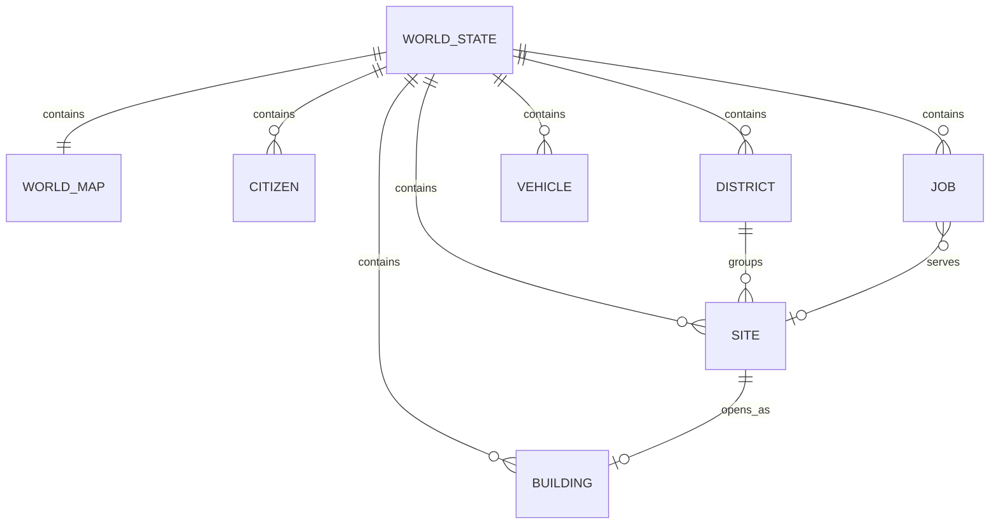

# World simulation data model

TL;DR: The package models one city as a JSON-compatible `WorldState`; its runtime records are grouped into map and citizen state, construction state, and simulation/scenario state (`packages/world-sim/src/types.ts:240-279`).

## Schema overview

The diagram shows the main in-memory relationships. These are TypeScript records, not database tables; persistence is performed by the consuming world room. The state links static map geometry to dynamic actors and construction records (`packages/world-sim/src/types.ts:74-85`, `packages/world-sim/src/types.ts:240-279`).

## Domains

- [City and actors](data-model/city-and-actors.md) — fixed geometry, POIs, residents, vehicles and buildings.
- [Projects and construction](data-model/projects-and-construction.md) — districts, sites, jobs, attempts, task indexes and their cleanup.
- [Simulation runtime](data-model/simulation-runtime.md) — config, random state, event sequence and scenario runtime.

## Ownership boundary

`WorldState` is explicitly plain JSON data and can be cloned using JSON serialization (`packages/world-sim/src/types.ts:1-4`, `packages/world-sim/src/world.ts:137-147`). `serializeWorld` excludes the generated map, and `parseWorld` regenerates it after checking the schema version (`packages/world-sim/src/world.ts:139-146`). This package defines no database schema or retention job; the world room stores serialized worlds and owns restart behavior (`src/rooms/world/server/store.ts:1-24`, `src/rooms/world/migrations.ts:1-14`).

<!-- lane-pilot:backlinks -->
## Referenced by

- [World simulation overview](overview.md)
