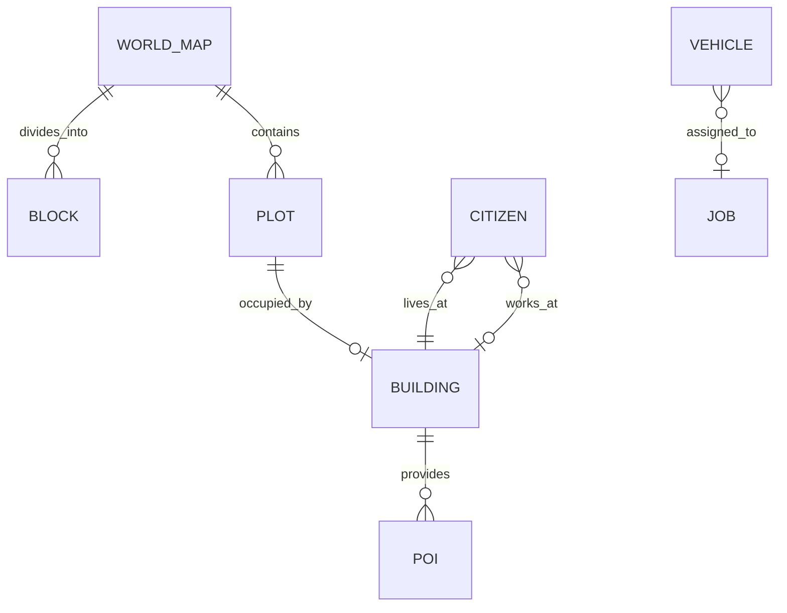

# City and actor state

TL;DR: Static map geometry supplies plots and walking/road graphs; dynamic buildings, POIs, citizens and vehicles refer to that geometry by IDs and graph nodes (`packages/world-sim/src/types.ts:49-85`, `packages/world-sim/src/types.ts:89-124`).

## Entity relationships

The records and links are in the shared types (`packages/world-sim/src/types.ts:49-85`, `packages/world-sim/src/types.ts:89-124`).

## Records

### `WorldMap`, `Block`, `Plot`, `Graph`

**Purpose:** `WorldMap` is the generated static geometry shared by worlds of the same schema; it contains blocks, plots, separate sidewalk/road graphs and office/depot plot IDs (`packages/world-sim/src/types.ts:49-85`, `packages/world-sim/src/map.ts:4-8`).

| Field | Meaning |
|---|---|
| `grid.tiles` | Row-major tile codes: 0 grass, 1 road, 2 sidewalk, 3 plot ground, 4 office, 5 park (`packages/world-sim/src/types.ts:74-85`). |
| `Block.id`, `i`, `j` | Stable block ID and its column/row in the 3×3 layout (`packages/world-sim/src/types.ts:54-55`, `packages/world-sim/src/map.ts:49-52`). |
| `Block.x0`, `z0`, `x1`, `z1` | Block bounds in world units (`packages/world-sim/src/types.ts:54-55`). |
| `Block.kind`, `corners` | Zone kind plus corner node IDs in the sidewalk graph (`packages/world-sim/src/types.ts:54-55`, `packages/world-sim/src/map.ts:62-65`). |
| `Plot.id`, `blockId`, `zone` | Plot key, containing block and zone kind (`packages/world-sim/src/types.ts:58-62`). |
| `Plot.x0`, `z0`, `x1`, `z1` | Building footprint bounds in world units (`packages/world-sim/src/types.ts:62-64`). |
| `Plot.side` | Door-facing side, `n` or `s` (`packages/world-sim/src/types.ts:65`). |
| `Plot.doorNode`, `entryNode`, `roadNode` | Sidewalk door/entry and vehicle stop node IDs (`packages/world-sim/src/types.ts:66-70`). |
| `Plot.slots` | Building placement destinations; each slot has `x`, `z`, `node`, and optional `kind`/`clip` (`packages/world-sim/src/types.ts:57-71`). |
| `sidewalk`, `road` | Node/edge graphs; edge lengths are world units and graph kind records walk/cross/enter/interior/road (`packages/world-sim/src/types.ts:49-52`). |
| `GNode.id`, `x`, `z` | Graph node index and world coordinates (`packages/world-sim/src/types.ts:50`). |
| `GEdge.a`, `b`, `len`, `kind` | Endpoint node indexes, world-unit length and graph edge category (`packages/world-sim/src/types.ts:49-52`, `packages/world-sim/src/graph.ts:17-21`). |
| `officePlotId`, `depotPlotId` | IDs of the office and depot plots used for starter buildings and service vehicles (`packages/world-sim/src/types.ts:82-85`, `packages/world-sim/src/map.ts:147-149`). |

**Lifecycle:** Generated by `createWorld` and regenerated by `parseWorld`; map geometry is not changed by simulation ticks (`packages/world-sim/src/world.ts:24-30`, `packages/world-sim/src/world.ts:142-146`). No status field applies.

`Graph` has `nodes` and `edges`; nodes carry `id`, `x`, `z`, edges carry `a`, `b`, `len`, `kind` (`packages/world-sim/src/types.ts:49-52`). `GNode` indexes its array position and coordinates; `GEdge.len` is in world units and `kind` is one of `walk`, `cross`, `enter`, `interior`, `road` (`packages/world-sim/src/types.ts:49-52`).

**Invariants and use:** Plot graph node IDs are used by plans; roads route vehicles and sidewalks route citizens (`packages/world-sim/src/map.ts:69-89`, `packages/world-sim/src/map.ts:132-149`, `packages/world-sim/src/ai.ts:129-130`). `serializeWorld` omits this generated data (`packages/world-sim/src/world.ts:139-146`).

### `Building` and `Poi`

**Purpose:** Buildings occupy plots and own POI IDs; POIs are action destinations and animation anchors (`packages/world-sim/src/types.ts:123-135`, `packages/world-sim/src/buildings.ts:19-38`).

| Field | Meaning |
|---|---|
| `Building.id` | Generated building key (`packages/world-sim/src/types.ts:125-135`, `packages/world-sim/src/buildings.ts:22-23`). |
| `Building.plotId` | Occupied plot; `plotBuilding[plotId]` indexes the building (`packages/world-sim/src/types.ts:125-135`, `packages/world-sim/src/construction.ts:67-73`). |
| `Building.kind` | `house`, `cafe`, `shop`, `office`, `depot`, `park`, `warehouse` or `workshop`; kind selects template POIs or plot-provided office/park slots (`packages/world-sim/src/types.ts:123-136`, `packages/world-sim/src/buildings.ts:5-17`, `packages/world-sim/src/buildings.ts:24-32`). |
| `Building.name` | Display name from starter-world population or construction input (`packages/world-sim/src/types.ts:125-135`, `packages/world-sim/src/buildings.ts:33-34`). |
| `districtId`, `poiIds`, `siteId` | Optional district and site origin plus POI IDs owned by the building (`packages/world-sim/src/types.ts:125-135`). |
| `Poi.id`, `buildingId` | POI key and owning building key (`packages/world-sim/src/types.ts:124`, `packages/world-sim/src/buildings.ts:26-33`). |
| `Poi.kind`, `clip` | Destination capability and animation name; kinds are template strings, not a closed enum (`packages/world-sim/src/types.ts:124`, `packages/world-sim/src/buildings.ts:5-15`). |
| `Poi.x`, `z`, `node` | World position and sidewalk graph node (`packages/world-sim/src/types.ts:124`). |
| `openedAt` | Simulation time in seconds when this building was added (`packages/world-sim/src/types.ts:134-135`, `packages/world-sim/src/buildings.ts:33-38`). |

**Lifecycle:** `addBuilding` creates building and POIs and indexes the plot; demolition removes the building and POIs (`packages/world-sim/src/buildings.ts:19-38`, `packages/world-sim/src/construction.ts:67-80`). No building status field exists; a completed site can be removed after 120 simulation seconds while the building remains (`packages/world-sim/src/construction.ts:15`, `packages/world-sim/src/construction.ts:333-339`).

**Invariants and use:** `building.poiIds` point into `state.pois`; `indexOf` rebuilds derived kind indexes when `rev` changes (`packages/world-sim/src/buildings.ts:41-64`). AI uses POI kinds as candidate destinations and reservation load as a soft occupancy count (`packages/world-sim/src/ai.ts:69-99`, `packages/world-sim/src/buildings.ts:66-77`).

### `Citizen`

**Purpose:** A citizen is an autonomous actor with role, home/work links, need values, an optional movement plan, job assignment and POI reservation (`packages/world-sim/src/types.ts:89-109`).

| Field | Meaning |
|---|---|
| `id`, `name`, `role`, `look` | Generated identity/display name, role and client palette index (`packages/world-sim/src/types.ts:89-96`, `packages/world-sim/src/world.ts:78-80`). |
| `homeId`, `workId`, `deskPoi` | Home/work building IDs and optional dedicated office desk; work and desk can be null (`packages/world-sim/src/types.ts:96-100`). |
| `speed` | Walking speed in world units per simulation second (`packages/world-sim/src/types.ts:100-101`, `packages/world-sim/src/sim.ts:46-56`). |
| `needs` | Energy, hunger, social, fun and work satisfaction values clamped to 0–1 (`packages/world-sim/src/types.ts:13-17`, `packages/world-sim/src/ai.ts:35-40`). |
| `pos`, `node`, `needs`, `plan` | Current endpoint position, sidewalk node, satisfaction values and current plan (`packages/world-sim/src/types.ts:101-106`). |
| `jobId`, `poi` | Active job ID and reserved POI ID (`packages/world-sim/src/types.ts:105-109`). |

**Role transitions:**

| From | To | Function | When |
|---|---|---|---|
| Initial assignment | `worker`, `builder`, `inspector` or `resident` | `populateCitizens` (`packages/world-sim/src/world.ts:55-85`) | World creation distributes citizens across starter office, depot, shops and resident pool. |
| `resident` | `worker` | `moveIn` (`packages/world-sim/src/construction.ts:261-269`) | A cafe, shop or workshop opens; up to two unassigned residents receive it as workplace. |
| `worker` | `resident` | `demolish` (`packages/world-sim/src/construction.ts:67-80`) | The building at a removed workplace is demolished. |

**Invariants and use:** Needs are updated every simulation tick; assigned jobs hold citizens out of autonomous action selection (`packages/world-sim/src/world.ts:93-108`). `snapshot` omits internal role-job details such as `jobId` and POI reservation while keeping public movement, needs, home and work values (`packages/world-sim/src/world.ts:151-183`).

### `Plan`

**Purpose:** A time-based movement/action description for a citizen or vehicle (`packages/world-sim/src/types.ts:24-45`).

| Field | Meaning |
|---|---|
| `id`, `actorId`, `action` | Plan key, owning actor and action kind (`packages/world-sim/src/types.ts:29-33`). |
| `path` | Ordered world-coordinate points (`packages/world-sim/src/types.ts:32-34`). |
| `startAt`, `arriveAt`, `until` | Start, arrival and plan expiry in simulation seconds (`packages/world-sim/src/types.ts:34-38`). |
| `speed` | Travel rate in world units per simulation second (`packages/world-sim/src/types.ts:34-36`). |
| `clip`, `target`, `lateral` | End animation, optional POI/building target and optional vehicle path offset (`packages/world-sim/src/types.ts:38-44`). |

**Lifecycle:** Replaced when `planTo` or `waitPlan` sets a new actor plan (`packages/world-sim/src/sim.ts:45-74`). The actor position stored in state is set to the path endpoint.

### `Vehicle`

**Purpose:** Vehicles represent trucks, rescue vans and ambient cars; plan and job IDs connect them to routes and work (`packages/world-sim/src/types.ts:111-122`).

| Field | Meaning |
|---|---|
| `id`, `kind` | Vehicle key and `truck`, `van` or `car` role (`packages/world-sim/src/types.ts:111-122`). |
| `node`, `pos`, `plan` | Road graph location and route state (`packages/world-sim/src/types.ts:112-122`). |
| `jobId`, `label` | Optional linked job and display label (`packages/world-sim/src/types.ts:118-120`). |

**Lifecycle:** Trucks disappear on return after delivery; rescue vans disappear on return after the call ends or maximum stay elapses; ambient cars disappear after their route (`packages/world-sim/src/construction.ts:192-209`, `packages/world-sim/src/services.ts:114-139`). There is no persisted vehicle status field.

## Invariants and ownership

World creation writes initial records; building creation writes buildings and POIs; AI and service operations read citizen/POI/graph records; construction writes and removes buildings (`packages/world-sim/src/world.ts:24-85`, `packages/world-sim/src/buildings.ts:19-38`, `packages/world-sim/src/construction.ts:67-80`). The world room persists the serialized state; this package has no city-record cleanup process beyond simulation removal paths (`src/rooms/world/server/store.ts:1-24`).

<!-- lane-pilot:backlinks -->
## Referenced by

- [World simulation data model](../data-model.md)
