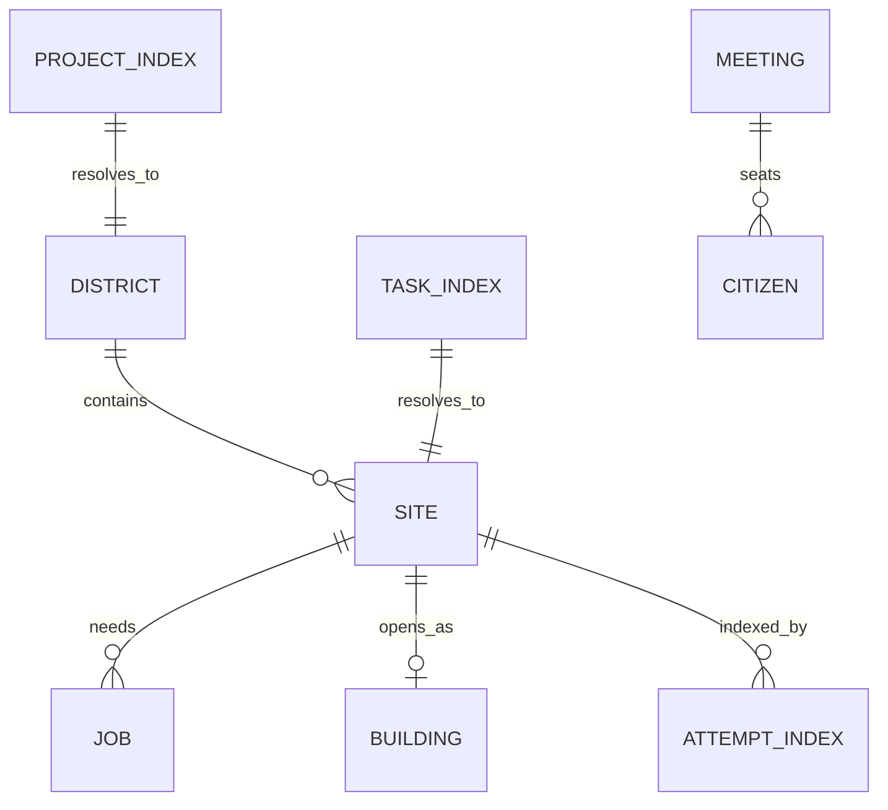

# Project and construction state

TL;DR: Project/task/attempt indexes connect Lane Pilot work to districts and sites; jobs track crew, material, repair and inspection work until their owning operation removes them (`packages/world-sim/src/types.ts:137-184`, `packages/world-sim/src/types.ts:267-275`).

## Entity relationships

The indexes are string-keyed maps in `WorldState`, not separate database tables (`packages/world-sim/src/types.ts:253-275`).

## Records

### `District`

**Purpose:** Assigns a Lane Pilot project a named/color-coded city block and plot IDs (`packages/world-sim/src/types.ts:137-138`).

| Field | Meaning |
|---|---|
| `id`, `projectId` | District key and upstream project identity; `projects[projectId]` resolves to district ID (`packages/world-sim/src/types.ts:137-138`, `packages/world-sim/src/types.ts:267-268`). |
| `name` | District label; defaults to project ID and can be updated (`packages/world-sim/src/types.ts:137-138`, `packages/world-sim/src/construction.ts:29-45`). |
| `blockId`, `plotIds` | Allocated city area and plot membership (`packages/world-sim/src/types.ts:137-138`). |
| `color` | Palette index value selected by stable hash of project ID (`packages/world-sim/src/construction.ts:20`, `packages/world-sim/src/construction.ts:41-45`). |
| `createdAt` | Simulation time in seconds at allocation (`packages/world-sim/src/types.ts:137-138`). |

**Lifecycle:** `ensureDistrict` reuses and renames an existing project district when the supplied name differs; otherwise it chooses a free block and creates one (`packages/world-sim/src/construction.ts:29-47`). District cleanup is not implemented in this workspace.

### `Site`

**Purpose:** Represents one task's construction plot and progress, linked to project/task IDs and attempts (`packages/world-sim/src/types.ts:142-166`).

| Field | Meaning |
|---|---|
| `projectId`, `taskId`, `attemptIds` | Upstream identifiers; task index key is `${projectId}/${taskId}`, attempt IDs each map to the same site (`packages/world-sim/src/types.ts:142-148`, `packages/world-sim/src/construction.ts:84-85`, `packages/world-sim/src/construction.ts:110-116`). |
| `id`, `districtId`, `plotId` | Site key, district key and city plot allocated to the site (`packages/world-sim/src/types.ts:142-150`). |
| `blueprint`, `name` | Building kind selected from task ID hash and display name from signal title or task ID (`packages/world-sim/src/construction.ts:93-100`). |
| `stageIndex`, `progress`, `target` | Current stage index 0–6, current-stage fraction 0–1, and highest stage authorized by upstream progress (`packages/world-sim/src/types.ts:151-155`). |
| `delivered`, `ordered` | Per-stage material arrival and in-flight flags; index corresponds to construction stage (`packages/world-sim/src/construction.ts:95-100`, `packages/world-sim/src/construction.ts:162-187`). |
| `collapsed`, `rejected`, `approved`, `rush` | Failure, verification and acceptance controls for progression (`packages/world-sim/src/types.ts:158-163`). |
| `buildingId`, `createdAt`, `openedAt` | Result building link and creation/open simulation times in seconds (`packages/world-sim/src/types.ts:163-166`). |

**Stage transitions:**

| From | To | Function | When |
|---|---|---|---|
| survey through paint (`0`–`5`) | Next stage | `updateConstruction` (`packages/world-sim/src/construction.ts:302-330`) | Current work reaches 1 and current stage is below target; emits `stage`. |
| Stage 2 or later | Previous stage, progress 0, `collapsed=true` | `damageSite` (`packages/world-sim/src/construction.ts:122-131`) | Failed attempt or scripted damage hits an unfinished site. |
| Collapsed | Same stage, `collapsed=false` | `updateConstruction` (`packages/world-sim/src/construction.ts:310-317`) | Repair crew completes 120 crew-seconds. |
| Paint (`5`) | Open (`6`) | `openSite` (`packages/world-sim/src/construction.ts:246-259`) | Paint completes with target 6. |

**Verification transitions:**

| From | To | Function | When |
|---|---|---|---|
| `approved=false`, `rejected=false` | Passed: `approved=true`, `rejected=false` | Signal rule (`packages/world-sim/src/binding.ts:43-49`) | Verification phase is `passed`. |
| Any verification flags | Failed: `approved=false`, `rejected=true` | Signal rule (`packages/world-sim/src/binding.ts:43-49`) | Verification phase is `failed`. |
| Any verification flags | Accepted: `approved=true`, `rejected=false`, `rush=true`, target 6 | Signal rule (`packages/world-sim/src/binding.ts:52-55`) | Attempt accepted; remainder is accelerated and opens. |

**Invariants and use:** Target only increases; `open` cannot be reached by percent mapping; accepted drives target to 6 (`packages/world-sim/src/construction.ts:22-23`, `packages/world-sim/src/construction.ts:117-120`, `packages/world-sim/src/binding.ts:52-55`). An opened site is removed after 120 simulation seconds, along with task and attempt indexes; its building persists (`packages/world-sim/src/construction.ts:15`, `packages/world-sim/src/construction.ts:333-339`).

### `Job`

**Purpose:** Holds an assigned activity's workers/vehicle, need, progress and current phase (`packages/world-sim/src/types.ts:168-183`).

| Field | Meaning |
|---|---|
| `id`, `kind` | Job key and `build`, `repair`, `deliver`, `inspect` or `rescue` activity (`packages/world-sim/src/types.ts:168-183`). |
| `state` | `open`, `active` or `done`; crew assignment sets active; finish deletes the job instead of retaining a done record (`packages/world-sim/src/types.ts:173-175`, `packages/world-sim/src/construction.ts:149-152`, `packages/world-sim/src/construction.ts:237-240`). |
| `crew`, `need` | Citizen IDs and required crew count (`packages/world-sim/src/types.ts:173-176`). |
| `vehicleId`, `stage` | Service vehicle and delivery stage reference (`packages/world-sim/src/types.ts:172-179`). |
| `workLeft`, `phase` | Remaining crew-seconds and `to_site`/`unload`/`return`/`work` activity phase (`packages/world-sim/src/types.ts:177-183`). |
| `createdAt`, `until` | Job creation and next action times in simulation seconds (`packages/world-sim/src/types.ts:181-183`). |

**Job transitions:**

| From | To | Function | When |
|---|---|---|---|
| absent | `open` | `newJob` (`packages/world-sim/src/construction.ts:154-158`) | Construction or repair need creates a job. |
| `open` | `active` | `assignCrews` (`packages/world-sim/src/construction.ts:222-245`) | A builder joins a build/repair crew. |
| delivery `to_site` | `return` | `advanceDeliveries` (`packages/world-sim/src/construction.ts:192-204`) | Truck reaches site and marks stage delivered. |
| active/returning | absent | `finishJob`, `advanceDeliveries`, or service cleanup (`packages/world-sim/src/construction.ts:149-152`, `packages/world-sim/src/construction.ts:205-208`, `packages/world-sim/src/services.ts:127-130`) | Work completes or a vehicle returns. |

### Indexes

These maps are stored fields on `WorldState`; their keys and values are defined by the operations that update the corresponding entity (`packages/world-sim/src/types.ts:258-275`).

| Field | Meaning |
|---|---|
| `plotBuilding`, `plotSite`, `plotDistrict` | Plot ID to occupying building, active site or district ID (`packages/world-sim/src/types.ts:258-263`). |
| `projects` | Upstream project ID to district ID (`packages/world-sim/src/types.ts:267-268`). |
| `attempts` | Attempt ID to site ID (`packages/world-sim/src/types.ts:269-270`). |
| `tasks` | `${projectId}/${taskId}` key to site ID (`packages/world-sim/src/types.ts:270-271`, `packages/world-sim/src/construction.ts:84-85`). |

### `Meeting`

**Purpose:** Tracks council attendance and office seats during a meeting (`packages/world-sim/src/types.ts:185-186`).

| Field | Meaning |
|---|---|
| `id` | Meeting key, formed as `m:${councilId}` (`packages/world-sim/src/services.ts:62-65`, `packages/world-sim/src/types.ts:185-186`). |
| `seats` | POI IDs of assigned office seats (`packages/world-sim/src/types.ts:185-186`, `packages/world-sim/src/services.ts:68-80`). |
| `citizenIds` | Citizen IDs held by the meeting (`packages/world-sim/src/types.ts:185-186`). |
| `since` | Simulation time in seconds when meeting started (`packages/world-sim/src/types.ts:185-186`). |

**Lifecycle:** Inserted by `startMeeting`; `endMeeting` releases each participant and deletes the record (`packages/world-sim/src/services.ts:62-83`, `packages/world-sim/src/services.ts:86-95`).

## Invariants and ownership

Signals write project/task/attempt links and construction status; construction updates jobs/sites and writes buildings; services read citizens/POIs and write meetings or service jobs (`packages/world-sim/src/binding.ts:29-84`, `packages/world-sim/src/construction.ts:272-341`, `packages/world-sim/src/services.ts:19-139`). This workspace's only cleanup is simulation-time cleanup of completed sites, returned vehicles and finished jobs; durable retention is owned by the world room (`packages/world-sim/src/construction.ts:333-339`, `packages/world-sim/src/services.ts:127-139`, `src/rooms/world/server/store.ts:1-24`).

<!-- lane-pilot:backlinks -->
## Referenced by

- [World simulation data model](../data-model.md)
