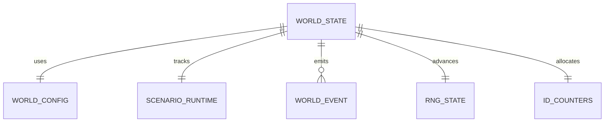

# Simulation runtime state

TL;DR: Runtime state records the clock, configuration, seeded random stream, ID counters, event sequence, and scenario cooldown/override state needed to continue a simulation (`packages/world-sim/src/types.ts:230-279`).

## Entity relationships

These conceptual records are fields on `WorldState`, not separate storage tables (`packages/world-sim/src/types.ts:240-279`, `packages/world-sim/src/types.ts:299-311`).

## Records

### `WorldConfig`

**Purpose:** Carries clock scale, fixed timestep, selected scenario IDs and starting game hour (`packages/world-sim/src/types.ts:230-238`).

| Field | Meaning |
|---|---|
| `hourSeconds` | Simulation seconds per game hour; default 120 (`packages/world-sim/src/world.ts:24-25`). |
| `fixedStep` | Simulation seconds per `step` tick; initialized to 1 (`packages/world-sim/src/world.ts:19`, `packages/world-sim/src/world.ts:25`). |
| `scenarios` | Scenario registry IDs active for this world; default IDs are set by `DEFAULT_SCENARIOS` (`packages/world-sim/src/world.ts:25`, `packages/world-sim/src/scenarios.ts:71-74`). |
| `startHour` | Game hour at simulation time zero; default 6 (`packages/world-sim/src/world.ts:24-25`). |

**Lifecycle:** Created by `createWorld`; no runtime function changes this config (`packages/world-sim/src/world.ts:24-30`).

### `WorldState` runtime fields

**Purpose:** Wraps city records with identity, clocks, random state, sequence counters and scenario state (`packages/world-sim/src/types.ts:240-279`).

| Field | Meaning |
|---|---|
| `schema` | Serialized shape version; the exported constant value 1 (`packages/world-sim/src/types.ts:7-8`, `packages/world-sim/src/types.ts:240-245`). |
| `seed`, `rng` | Initial seed and current 32-bit pseudo-random generator state (`packages/world-sim/src/types.ts:240-245`, `packages/world-sim/src/rng.ts:3-10`). |
| `time`, `tick`, `carry` | Elapsed simulation seconds, completed ticks and accumulated remainder below a fixed step (`packages/world-sim/src/types.ts:246-250`, `packages/world-sim/src/world.ts:111-117`). |
| `counters` | Per-prefix integer counters used to generate IDs (`packages/world-sim/src/types.ts:251`, `packages/world-sim/src/rng.ts:35-39`). |
| `eventSeq` | Last assigned world event number, incremented on each emitted event (`packages/world-sim/src/types.ts:252`, `packages/world-sim/src/sim.ts:11-13`). |
| `rev` | Building-change revision used to invalidate derived building/POI indexes (`packages/world-sim/src/types.ts:277-278`, `packages/world-sim/src/buildings.ts:41-60`). |

**Invariants:** Random draws mutate and persist `rng`; IDs mutate `counters`; emitted event sequence numbers increase from the saved `eventSeq` (`packages/world-sim/src/rng.ts:4-10`, `packages/world-sim/src/rng.ts:35-39`, `packages/world-sim/src/sim.ts:11-13`).

### `ScenarioRuntime`

**Purpose:** Tracks event cooldown timestamps, temporary forced actions and the last scripted-event evaluation time (`packages/world-sim/src/types.ts:224-229`).

| Field | Meaning |
|---|---|
| `lastFired` | Scenario/event key to simulation-time seconds of last firing (`packages/world-sim/src/types.ts:226`, `packages/world-sim/src/scenarios.ts:142-148`). |
| `forced` | Action/filter overrides ending at a simulation-time second (`packages/world-sim/src/types.ts:226`, `packages/world-sim/src/scenarios.ts:99-105`, `packages/world-sim/src/scenarios.ts:133-142`). |
| `lastCheck` | Last event-evaluation time; tick evaluates after at least 15 simulation seconds (`packages/world-sim/src/types.ts:226`, `packages/world-sim/src/world.ts:19-20`, `packages/world-sim/src/world.ts:94-97`). |

**Forced action lifecycle:**

| From | To | Function | When |
|---|---|---|---|
| absent | appended with `until` | `apply` (`packages/world-sim/src/scenarios.ts:121-134`) | A `force_action` event is applied; duration is `forHours × hourSeconds`. |
| active | removed | `runScenarioEvents` (`packages/world-sim/src/scenarios.ts:137-149`) | Evaluator filters entries where current simulation time is no longer below `until`. |

**Event cooldown lifecycle:**

| From | To | Function | When |
|---|---|---|---|
| absent or prior time | current simulation time | `runScenarioEvents` (`packages/world-sim/src/scenarios.ts:142-148`) | Event hours/cooldown/conditions pass and effects run. |

## Reads, writes and retention

`step` and `catchUp` read and mutate clock, random state, counters and scenario runtime; event emitters increment `eventSeq` (`packages/world-sim/src/world.ts:111-135`, `packages/world-sim/src/sim.ts:11-13`). `serializeWorld` preserves runtime state except generated map; the world room owns persistence and retention outside this package (`packages/world-sim/src/world.ts:139-147`, `src/rooms/world/server/store.ts:1-24`). The package has no periodic cleanup for ID counters, event sequence or scenario cooldown history.

<!-- lane-pilot:backlinks -->
## Referenced by

- [World simulation data model](../data-model.md)
